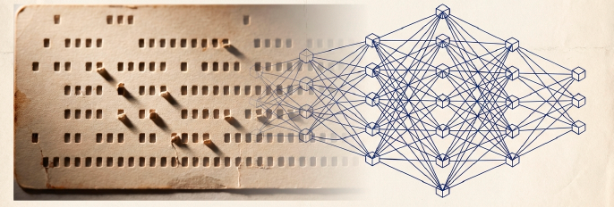
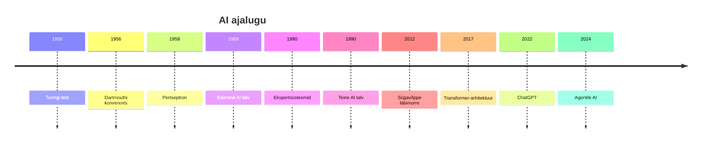

---
tags:
  - AI
  - Masinõpe
---

# 1. Sissejuhatus: mis on tehisintellekt?

<figure markdown="span">
  
  <figcaption>Joonis 1.1. Tehisintellekti evolutsioon ja arhitektuur (Talvik, 2025). Loodud tehisintellekti abil.</figcaption>
</figure>

!!! abstract "Eesmärgid"
    - Oskan selgitada, mis on tehisintellekt ja kuidas see erineb tavalisest programmeerimisest
    - Tean AI ajaloo olulisemaid verstaposte (Turing, pertseptron, sügavõpe, GPT)
    - Mõistan erinevust kitsa AI (ANI), üld-AI (AGI) ja super-AI (ASI) vahel
    - Oskan tuua näiteid AI rakendamisest IT-valdkonnas

## Masin, mis "mõtleb"

Kujuta ette tavalist arvutiprogrammi. Kui kirjutad `if temperature > 30: turn_on_fan()` — arvuti teeb täpselt seda, mida talle öeldi. Ta ei "mõista" kuumust, tal pole arvamust ega kogemust. Programmeerija mõtleb, arvuti täidab käsku.

Tehisintellekt keerab selle loogika pea peale. Selle asemel et programmeerija kirjutaks iga reegli käsitsi välja, antakse masinale hulk näiteid ja öeldakse: "õpi ise reeglid välja." Tulemus on süsteem, mis suudab teha otsuseid olukordades, mida programmeerija ette ei näinud — sest ta on mustrid ise avastanud.

See on põhimõtteline erinevus. Traditsiooniline programm järgib *reegleid*, tehisintellekt avastab *mustreid*.

??? question "🤔 Mõtle kaasa"
    Mõtle oma igapäevaelule: kas sulle meenub olukord, kus sa tegid otsuse "kõhutunde" peale, ilma et oleksid reeglid läbi mõelnud? Näiteks — sa tunned kohe ära, kas e-kiri on rämpspost, ilma et loeksid sõna-sõnalt läbi. Kuidas sa seda tegelikult teed?

    ??? tip "Vihje"
        Mõtle sellele, kui palju e-kirju oled oma elu jooksul näinud. Sa oled *mustrid* ise ära õppinud.

    ??? success "Vastus"
        Inimese intuitsioon on sageli teadvustamata mustrituvastus — sa oled tuhandeid e-kirju näinud ja aju on ise õppinud tunnused eristama. AI teeb sisuliselt sama asja, ainult et matemaatiliselt ja palju suurema andmehulgaga.

!!! info "Definitsioon"
    **Tehisintellekt** (AI, *Artificial Intelligence*) on arvutisüsteem, mis suudab täita ülesandeid, mille lahendamine nõuab tavaliselt inimese intellekti — näiteks keele mõistmine, mustrite tuvastamine, otsuste tegemine ja õppimine kogemusest.[^russell]

## Lühike ajalugu: talvedest kevadeni

AI ajalugu on täis suuri lubadusi, valulikke pettumusi ja ootamatuid läbimurdeid. Selle tundmine aitab mõista, miks just praegu on AI nii võimas — ja miks ta varem ei olnud.

### Esimesed sammud (1940–1960)

Kõik algas küsimusest. 1950. aastal avaldas briti matemaatik Alan Turing artikli, mis küsis otse: "Kas masinad suudavad mõelda?"[^turing] Vastuse asemel pakkus ta välja testi — kui inimene vestleb masinaga ja ei suuda eristada seda inimesest, siis võib masinat pidada "mõtlevaks." Turingi test on tänaseni üks AI alustala, kuigi kaasaegsed teadlased vaidlevad selle piirangute üle.

1956. aastal korraldati Dartmouthi konverents, kus John McCarthy, Marvin Minsky ja teised teadlased andsid valdkonnale ametliku nime: *Artificial Intelligence*. Nad olid optimistlikud — arvati, et "ühe suve jooksul" suudetakse lahendada masinintellekti probleem.[^dartmouth] See hinnang oli pea 70 aasta võrra enneaegne.

1958. aastal ehitas Frank Rosenblatt **pertseptroni** — esimese tehisnärvivõrgu, mis suutis õppida. Pertseptron võttis sisendeid, korrutas need kaaludega ja andis väljundi. Lihtne, aga revolutsiooniline — masin õppis ise, ilma et keegi iga reeglit käsitsi programmeerinuks.

### AI talved (1970–1990)

Esialgne entusiasm jahenes kiiresti. Selgus, et pertseptron ei suuda lahendada isegi lihtsaid probleeme nagu XOR-funktsioon (Minsky ja Papert tõestasid seda 1969. aastal matemaatiliselt).[^minsky] Rahastajad kaotasid huvi. Saabus esimene **AI talv** — periood, mil AI uurimisse voolav raha ja huvi kuivas kokku.

1980ndatel tulid ekspertsüsteemid — programmid, mis sisaldasid tuhandeid "kui-siis" reegleid, mille inimeksperdid olid käsitsi kirjutanud. Need töötasid kitsastes valdkondades hästi, kuid olid kallid, jäigad ja ei suutnud õppida. Teine AI talv saabus 1990ndate alguses, kui ekspertsüsteemide piirangud said ilmseks.

??? question "🤔 Mõtle kaasa"
    AI talved tekkisid, sest ootused ületasid reaalseid tulemusi. Kas praegune AI buum (ChatGPT, Claude, Copilot) võiks samuti lõppeda talvega? Mis on seekord teisiti — ja mis on sarnane?

    ??? tip "Vihje"
        Mõtle kolmele asjale, mis on praegu olemas, aga 1980ndatel ei olnud: andmete hulk, arvutusvõimsus ja algoritmide kvaliteet.

    ??? success "Vastus"
        Seekord toetab AI-d kolm sammast, mida varem ei olnud: (1) internet on andnud triljoneid sõnu treenimisandmeid, (2) GPU-d pakuvad tohutut paralleelset arvutusvõimsust, (3) Transformer-arhitektuur on tõhusam kui varasemad algoritmid. Samas — ka praegune entusiasm sisaldab ülepaisutatud lubadusi (AGI "järgmisel aastal"), mis on sarnane varasematele talvedele. Terve skeptitsism on alati põhjendatud.

### Sügavõppe revolutsioon (2010ndad)

Kolm asja muutusid samal ajal ja seda nimetatakse mõnikord "õnnelikuks õnnetuseks": graafikakaardid (GPU-d), mis töötati algselt välja videomängude renderdamiseks, osutusid ideaalseks platvormiks maatriksarvutustele, mis moodustavad närvivõrkude treenimise tuuma. Internet andis andmed, GPU-d andsid kiiruse, Hinton andis algoritmi.

Erinevalt tavalisest protsessorist (CPU), mis on optimeeritud keerukate loogiliste operatsioonide järjestikuseks täitmiseks, on GPU loodud tegema miljardeid lihtsaid tehteid samaaegselt. Kui tipptasemel CPU-l on ligikaudu 10 võimsat tuuma, siis kaasaegses graafikakaardis on 30 000–40 000 mikrotuuma. See mastaabi vahe muutis AI treenimise praktiliselt võimalikuks.

2012. aastal demonstreeris Geoffrey Hintoni meeskond, et sügav närvivõrk (AlexNet) võidab pildituvastuse võistluse ImageNet ülekaalukalt.[^alexnet] See hetk käivitas praeguse AI buumi.

2016 — DeepMindi AlphaGo võitis Go mängus maailmameistri Lee Sedoli. Go-mängu on triljoneid kordi rohkem võimalikke seise kui males, seega jõu jõuga läbi arvutamine polnud võimalik. Masin pidi *mõistma* strateegiat.

### Suurte keelemudelite ajastu (2020ndad)

2022. aasta novembris avaldas OpenAI ChatGPT ja maailm muutus üleöö. Esimest korda sai iga inimene oma telefonis rääkida masinaga, mis *tundus* mõtlevat. Miljon kasutajat viie päevaga. Sellele järgnesid Anthropicu Claude, Google'i Gemini, Meta Llama ja paljud teised. Täna, 2026. aastal, kasutavad suurte keelemudelite (LLM) teenuseid miljardid inimesed igapäevaselt.

| Aasta | Sündmus | Mõju |
|---|---|---|
| 1950 | Turingi test | Küsimuse püstitamine: "Kas masinad suudavad mõelda?" |
| 1956 | Dartmouthi konverents | AI valdkond saab nime |
| 1958 | Pertseptron | Esimene õppiv tehisnärvivõrk |
| 1969 | Minsky & Papert | Pertseptroni piirangud tõestatud → esimene AI talv |
| 2012 | AlexNet (ImageNet) | Sügavõpe läbimurre — AI buum algab |
| 2016 | AlphaGo vs Lee Sedol | Masin võidab inimest strateegias, mitte jõus |
| 2022 | ChatGPT | LLM-id jõuavad igaühe kätte |
| 2024–2026 | Claude, Gemini, Llama | Agentlik AI, koodi genereerimine, MCP |

*Tabel 1.1. AI ajaloo verstapostid*

<figure markdown="span">

  <figcaption>Joonis 1.1. AI ajaloo verstapostid — talvedest ja kevadetest (Talvik, 2026).</figcaption>
</figure>

## Linnu ja lennuki analoogia

Tehisintellekti mõistmiseks on kasulik üks analoogia, mis aitab vältida kahte levinud viga: AI üle- ja alahindamist.

Lennuk ehitati lindudest inspireerituna, kuid ta ei lehvita tiibu. Ta on kiire, jäik ja mehaaniline, samas kui lind on paindlik, bioloogiline ja kohanduv. Mõlemad lahendavad aga edukalt sama probleemi — lendamist. Lennuk kannab korraga tuhat inimest, aga ei suuda istuda oksale. Lind ei kanna tuhat inimest, aga manööverdab puude vahel.

Sama kehtib intelligentsuse kohta. AI ja inimaju lahendavad mõlemad "mõtlemise" probleemi, aga täiesti erineval viisil:

| Omadus | Inimaju | AI (närvivõrk) |
|---|---|---|
| Põhielement | Bioloogiline neuron | Matemaatiline parameeter |
| Elementide arv | ~90 miljardit neuronit | Miljarditest triljoniteni |
| Ühendused | ~450 triljonit sünapsit | ~1000× vähem |
| Signaali kiirus | Aeglane (keemilis-elektriline) | ~1 miljon korda kiirem |
| Energiatarve | ~100 vatti (nagu hõõglamp) | Kilovatid kuni megavatid |
| Õppimisallikas | Füüsiline maailm (meeled, kogemus) | Tekst (internet, raamatud) |

*Tabel 1.2. Inimaju vs tehisintellekt*

See tabel paljastab midagi olulist: kuigi AI on umbes tuhat korda lihtsama ühendusmustriga kui inimaju, kompenseerib ta selle miljon korda kiirema signaaliedastusega. Aga tal on fundamentaalne piirang — ta on "Gutenbergi pärija", sündinud tekstist. Ta *teab*, mis on lõhn, sest on lugenud miljoneid kirjeldusi, aga ta ei *tunne* seda.

!!! tip "Miks see IT-spetsialistile oluline on"
    Kui mõistad, et AI on "lennuk, mitte lind" — sa ei oota temalt asju, mida ta ei suuda (maailmamõistmine, füüsiline intuitsioon), ja sa kasutad maksimaalselt seda, mida ta suudab (kiire teksti- ja koodi genereerimine, mustrite tuvastamine, andmeanalüüs).

## AI kolm taset

Mitte kõik tehisintellektid pole võrdsed. Teadlased eristavad kolme taset, ja nende vahe mõistmine aitab hinnata, mida tänapäeva AI tegelikult suudab — ja mida mitte.

### ANI — kitsas tehisintellekt

**ANI** (*Artificial Narrow Intelligence*) on masin, mis on ülihea *ühes* konkreetses ülesandes. Spotify soovitab sulle muusikat, Gmail filtreerib rämpsposti, Tesla autopiloot juhib maanteel. Iga neist on ANI — nad ei suuda teha midagi muud peale oma kitsa ülesande. Rämpsposti filter ei oska autot juhtida ega muusikat soovitada.

**Kõik tänased AI süsteemid on ANI.** Ka ChatGPT ja Claude, kuigi nad *tunduvad* üldised, on tegelikult kitsad — nad on treenitud teksti genereerima ja teevad seda hästi, aga neil pole tegelikku maailmamõistmist ega teadvust.

### AGI — üldine tehisintellekt

**AGI** (*Artificial General Intelligence*) oleks masin, mis suudab *ükskõik millist* intellektuaalset ülesannet, mida inimene suudab. Ta õpiks uusi asju ilma ümbertreenimiseta, mõistaks konteksti ja tal oleks terve mõistus. AGI-d **ei ole veel olemas**. Mõned teadlased arvavad, et see on 5–20 aasta kaugusel, teised arvavad, et seda ei pruugi kunagi tulla.[^goertzel]

### ASI — supertehisintellekt

**ASI** (*Artificial Super Intelligence*) ületaks inimest *igas* valdkonnas. See on puhas spekulatsioon ja kuulub praegu rohkem filosoofia kui insenerimaailma.

!!! bug "🔍 AI eksis — leia viga"
    **Küsimus AI-le:** "Kas ChatGPT on AGI?"

    **AI vastas:** *"ChatGPT on AGI-lähedane süsteem, sest ta suudab vastata küsimustele kõigis valdkondades — matemaatikast meditsiini ja kunstini. See näitab üldist intelligentsust."*

    Kas see vastus on korrektne?

    ??? tip "Analüüs"
        See on **vale**. ChatGPT on ANI — kitsas tehisintellekt, mis on treenitud teksti genereerimiseks. Ta *tundub* üldine, sest treenimisandmed katsid paljusid valdkondi, aga ta ei *mõista* neid valdkondi. Ta ennustab järgmist tokenit, mitte ei mõtle. Tal pole eesmärke, kogemust ega maailmamõistmist.

        Miks AI selle vea tegi? Sest "ChatGPT on AGI" on lause, mida on internetis palju kordi kirjutatud — ja LLM genereerib statistiliselt tõenäolisi jätkusid, olenemata sellest, kas need on tõesed.

        **Kasuta → Kahtlusta → Kontrolli:** AI andis vastuse (kasutasid), see kõlab usutavalt (kahtlustad), aga fakti kontrollides selgub, et see on vale (kontrollisid). Täpselt nii tuleb alati teha.

## AI IT-valdkonnas

IT-süsteemide spetsialistina puutud AI-ga kokku igapäevaselt. Siin on mõned konkreetsed näited, kuidas AI juba praegu IT-tööd muudab:

**Monitooring ja anomaaliate tuvastamine.** AI analüüsib logisid ja tuvastab tavapärasest erinevaid mustreid — näiteks ebanormaalne liiklus, mis viitab küberrünnakule, või serveri käitumine, mis ennustab rikkeid enne nende toimumist.

**Automaatne koodikirjutamine.** GitHub Copilot, Claude Code ja teised AI-abilised genereerivad koodi, kirjutavad teste ja refaktoreerivad olemasolevat tarkvara. IT-spetsialist ei pea enam iga skripti nullist kirjutama — ta kirjeldab, mida ta tahab, ja AI genereerib algversiooni.

**Kasutajatugi ja vestlusrobotid.** AI-põhised vestlusrobotid vastavad levinud küsimustele, sorteerivad pileteid ja suunavad keerukamad probleemid õigele spetsialistile.

**Dokumentatsiooni genereerimine.** AI aitab kirjutada konfiguratsioonijuhendeid, API dokumentatsiooni ja SOP-sid (*Standard Operating Procedure*), vähendades aega, mis kulub igavale, aga vajalikule paberitööle.

**Turvalisus.** AI tuvastab phishing-kirju, analüüsib pahavara ja hindab haavatavusi kiiremini kui inimene seda käsitsi suudaks.

??? question "🤔 Mõtle kaasa"
    AI-d kirjeldatakse sageli kui "intellekti võimendit" — ta ei asenda inimest, vaid teeb ta võimsamaks. Nagu kalkulaator ei asendanud matemaatikut, vaid vabastas ta rutiinsest arvutamisest. Aga kas on olukordi, kus AI "võimendi" võib muutuda "kargiks" — kus inimene kaotab oskuse, sest AI teeb töö tema eest?

    ??? tip "Vihje"
        Mõtle GPS-ile. Kui alati kasutad navigaatorit, kas sa oskad veel ilma selleta sõita? Mis juhtub, kui GPS ei tööta?

    ??? success "Vastus"
        See on reaalne risk. Juuniorarendaja, kes ei kirjuta kunagi koodi ilma Copilotita, ei pruugi kunagi arendada sügavat koodimõistmist. IT-spetsialist, kes laseb AI-l alati konfiguratsioone genereerida, ei pruugi märgata turvanõrkust. Võti on tasakaal: kasuta AI-d efektiivsuse jaoks, aga veendu, et mõistad, mida AI toodab. **Kasuta → Kahtlusta → Kontrolli.**

---

## Kriitiline mõtlemine

??? question "Stsenaarium 1: Perekonnaliige küsib AI kohta"
    Sinu ema/isa/vanaema küsib sinult: "Kas tehisintellekt võtab inimestelt töö ära? Ma kuulsin uudistest, et varsti pole kedagi vaja." Ta on murelik.

    Kuidas sa vastaksid — nii, et oleksid aus, aga ei tekitaks asjatut hirmu ega samas ei pisendaks AI mõju?

    ??? tip "Kaalumiseks"
        Mõtle sellele, mida sa tead AI kolmest tasemest (ANI/AGI/ASI). Kõik praegused AI süsteemid on ANI — kitsad. Nad ei asenda *inimest*, nad asendavad *ülesandeid*. Aga mõned ülesanded on inimeste põhitöö...

        Mõtle ka ajaloolistele paralleelidele: kas kalkulaator kaotas matemaatikute töökohad? Kas Excel kaotas raamatupidajate töökohad? Mis tegelikult juhtus?

        Aus vastus tunnistab mõlemat poolt: AI muudab paljude tööde sisu (rutiinne osa automatiseerub) ja mõned rollid kaovad, aga tekivad uued. Kõige haavatavamad on need, kes ei õpi AI-ga koos töötama.

??? question "Stsenaarium 2: Klassikaaslane sõltub AI-st"
    Sinu klassikaaslane kasutab kodutööde jaoks AI-d nii: kopeerib ülesande ChatGPT-sse, kopeerib vastuse tagasi, esitab. Ta ei loe vastust isegi läbi. "Miks peaksin ise pingutama, kui AI teeb paremini?" ütleb ta.

    Mis sa arvad — kas ta teeb targalt? Mis juhtub pikemas perspektiivis?

    ??? tip "Kaalumiseks"
        Mõtle sellele: mida sa kooli lõpus tegelikult vajad — vastuseid või oskust probleeme lahendada? Vastused on internetis tasuta. Oskus mõelda ei ole.

        Töövestlusel ei küsita "kirjuta mulle ChatGPT prompt." Küsitakse: "Meil on probleem X, kuidas sa seda lahendaksid?" Kui sa pole kunagi ise mõelnud, ei oska sa vastata.

        Aga teine äärmus on ka vale — AI mittekasutamine on nagu kalkulaatori keelamine. Küsimus pole "kas kasutada", vaid "kuidas kasutada nii, et ise ka areneksid."

---

## Kokkuvõte

Tehisintellekt ei ole üks konkreetne tehnoloogia, vaid lai valdkond, mis hõlmab süsteeme, mis suudavad õppida andmetest ja teha otsuseid. AI on inspireeritud inimajust, aga töötab täiesti teisiti — nagu lennuk on inspireeritud linnust, aga ei lehvita tiibu. AI ajalugu ulatub 1950ndatesse, kuid alles viimase kümnendi jooksul on riistvara (GPU-d), andmed (internet) ja algoritmid (Transformer) jõudnud tasemele, kus AI on muutunud igapäevaseks tööriistaks. Kõik tänased AI süsteemid on kitsas tehisintellekt (ANI) — neil pole üldist intelligentsust ega teadvust. IT-valdkonnas muudab AI juba praegu tööd, aga oluline on säilitada tasakaal: **kasuta** AI-d efektiivsuse jaoks, **kahtlusta** iga väljundit ja **kontrolli** enne usaldamist.

---

## Enesekontroll

??? question "1. Mis vahe on kitsas AI-l (ANI) ja üldisel AI-l (AGI)?"
    ??? tip "Vihje"
        Mõtle Spotify soovitusalgoritmi peale. Kas ta suudaks samal ajal ka autot juhtida?

    ??? success "Vastus"
        ANI on süsteem, mis oskab teha *ühte* konkreetset ülesannet hästi (nt pildituvastus, teksti genereerimine, rämpsposti filtreerimine). AGI oleks süsteem, mis suudab *ükskõik millist* intellektuaalset ülesannet — sealhulgas õppida uusi asju ilma ümbertreenimiseta ja mõista konteksti. AGI-d ei ole veel olemas.

??? question "2. Mis toimus Dartmouthi konverentsil 1956. aastal ja miks see oluline on?"
    ??? tip "Vihje"
        Enne seda konverentsi ei olnud valdkonnal isegi nime. Mis muutus?

    ??? success "Vastus"
        Dartmouthi konverentsil anti tehisintellekti valdkonnale ametlik nimi (*Artificial Intelligence*). John McCarthy, Marvin Minsky ja teised teadlased kogunesid arutama, kas masinad suudavad mõelda. See märgib AI kui iseseisva teadusvaldkonna sündi.

??? question "3. Nimeta kolm konkreetset AI rakendust IT-süsteemide haldamises."
    ??? tip "Vihje"
        Mõtle igapäevasele IT-tööle: logid, skriptid, kasutajatugi...

    ??? success "Vastus"
        (1) Anomaaliate tuvastamine logidest ja monitooringust — AI märkab ebanormaalset käitumist. (2) Automaatne koodi genereerimine tööriistadega nagu Copilot või Claude Code. (3) AI-põhised vestlusrobotid kasutajatoe piletite sorteerimiseks.

??? question "4. Miks ei ole ChatGPT ja Claude üldine tehisintellekt (AGI)?"
    ??? tip "Vihje"
        Mõtle sellele, mida LLM tegelikult teeb ühe sõnaga: ta ... järgmist tokenit.

    ??? success "Vastus"
        Need süsteemid on tõenäosuslikud teksti generaatorid — nad *ennustavad* järgmist tokenit väga hästi, aga neil pole maailmamõistmist, kogemust ega teadvust. Nad on "Gutenbergi pärijad" — treenitud tekstil, mitte füüsilisel kogemusel. Nad *teavad*, mis on lõhn, sest on lugenud miljoneid kirjeldusi, aga ei *tunne* seda.

??? question "5. Mis on AI talv ja miks neid on olnud mitu?"
    ??? tip "Vihje"
        Mõtle Dartmouthi lubadusele "ühe suve jooksul" ja sellele, mis tegelikult juhtus.

    ??? success "Vastus"
        AI talv on periood, mil huvi ja rahastus AI uurimisse kahaneb järsult. Talved tekivad, sest ootused ületavad reaalseid tulemusi. Esimene talv tuli pärast pertseptroni piirangute avastamist (1970ndad), teine pärast ekspertsüsteemide läbikukkumist (1990ndad). Muster on alati sama: liiga palju lubatakse liiga vara.

[^russell]: Russell, S. & Norvig, P. (2021). *Artificial Intelligence: A Modern Approach* (4th ed.). Pearson. https://aima.cs.berkeley.edu/
[^turing]: Turing, A. M. (1950). Computing Machinery and Intelligence. *Mind*, 59(236), 433–460. https://doi.org/10.1093/mind/LIX.236.433
[^dartmouth]: McCarthy, J. et al. (1955). *A Proposal for the Dartmouth Summer Research Project on Artificial Intelligence*. https://raysolomonoff.com/dartmouth/boxa/dart564props.pdf
[^minsky]: Minsky, M. & Papert, S. (1969). *Perceptrons: An Introduction to Computational Geometry*. MIT Press.
[^alexnet]: Krizhevsky, A., Sutskever, I. & Hinton, G. E. (2012). ImageNet Classification with Deep Convolutional Neural Networks. *Advances in Neural Information Processing Systems*, 25.
[^goertzel]: Goertzel, B. (2014). *Artificial General Intelligence: Concept, State of the Art, and Future Prospects*. Journal of Artificial General Intelligence, 5(1), 1–46.
