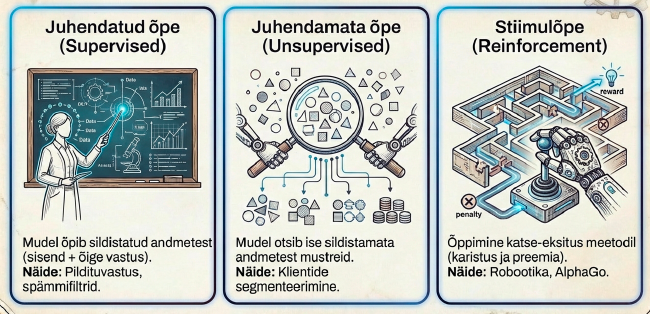
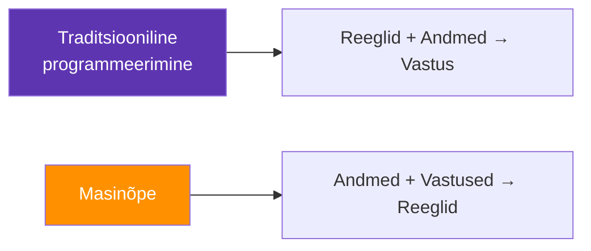
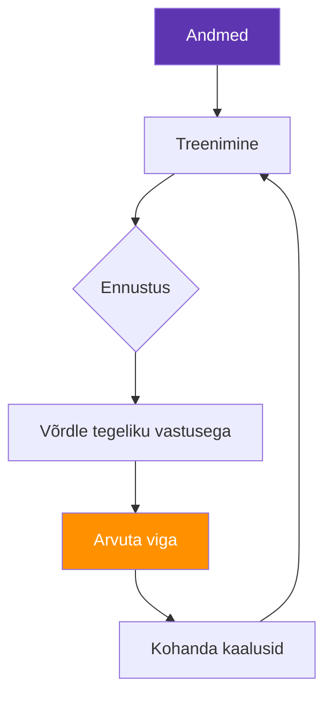

---
tags:
  - Masinõpe
---

# 2. Masinõppe alused

<figure markdown="span">
  
  <figcaption>Joonis 2.1. Masinõppe kolm põhitüüpi (Talvik, 2025). Loodud tehisintellekti abil.</figcaption>
</figure>

!!! abstract "Eesmärgid"
    - Oskan selgitada, mis on masinõpe ja kuidas see erineb traditsioonilisest programmeerimisest
    - Tean kolme põhilist masinõppe tüüpi: juhendatud, juhendamata ja stiimulõpe
    - Mõistan treenimise, valideerimise ja testimise protsessi
    - Oskan selgitada üle- ja alasobitumise probleemi
    - Tean levinumaid masinõppe algoritme ja nende kasutusvaldkondi

## Traditsioonilisest programmeerimisest masinõppeni

Traditsioonilises programmeerimises kirjutab arendaja reeglid: "kui temperatuur on üle 30 kraadi JA niiskus üle 80%, siis lülita jahutus sisse." Iga olukord tuleb ette näha ja iga reegel käsitsi kodeerida. See toimib hästi, kui reeglid on selged ja lõplikud.

Aga mis siis, kui reegleid on tuhandeid? Või kui sa ise ei tea, millised reeglid kehtivad? Näiteks — kuidas kirjutada programm, mis eristab kassi fotot koera fotost? Sa ei suuda sõnastada reeglit "kassil on teravad kõrvad ja koeral ümarad", sest mõnel kassil on ümarad kõrvad ja mõnel koeral teravad.

**Masinõpe** (*Machine Learning*, ML) keerab loogika ümber. Selle asemel et öelda masinale *kuidas* otsustada, näitad talle tuhandeid näiteid ja lased tal *ise* mustrid avastada.[^bishop]

<figure markdown="span">

  <figcaption>Joonis 2.2. Traditsiooniline programmeerimine vs masinõpe — loogika on pööratud (Talvik, 2025).</figcaption>
</figure>

??? question "🤔 Mõtle kaasa"
    Kujuta ette, et pead kirjutama programmi, mis eristab rämpsposti tavalisest e-kirjast. Proovi sõnastada 5 reeglit, mille järgi sa ise rämpsposti ära tunned. Kas need reeglid katavad kõik juhtumid?

    ??? tip "Vihje"
        Mõtle: "sisaldab sõna TASUTA" — aga mis siis, kui rämps kasutab kirjapilti "T4SUTA"? "Palju suurtähti" — aga mis siis, kui see on lihtsalt kolleegi entusiastlik kiri?

    ??? success "Vastus"
        Reeglipõhine lähenemine jookseb kiiresti ummikusse, sest rämpsposti saatjad kohanduvad pidevalt. Masinõpe lahendab selle, sest mudel vaatab tuhandeid näiteid ja leiab mustreid, mida sa ei suudaks käsitsi sõnastada — kaasa arvatud mustrid, mis hõlmavad sadu tunnuseid korraga.

## Kolm masinõppe tüüpi

Masinõpet saab jagada kolme kategooriasse selle järgi, millist tagasisidet masin treenimise ajal saab.

### Juhendatud õpe (*Supervised Learning*)

Kõige levinum tüüp. Masinale antakse näited koos õigete vastustega — näiteks e-kirjad, mis on märgistatud "rämpspost" või "tavaline." Masin õpib mustrid ära ja suudab uute kirjade kohta ennustada.

Kaks ülesandetüüpi:

- **Klassifitseerimine** — vastus on kategooria. Kas see e-kiri on rämps? Kas see nahapilt on healoomuline?
- **Regressioon** — vastus on arv. Kui palju maksab see korter? Kui suur on serveri koormus homme kell 14?

### Juhendamata õpe (*Unsupervised Learning*)

Masinale antakse andmed *ilma* õigete vastusteta. Masin peab ise leidma struktuuri — grupeerima sarnased asjad kokku või tuvastama anomaaliaid.

- **Klasterdamine** — grupeeri kliendid käitumise järgi segmentidesse
- **Anomaaliate tuvastamine** — leia andmetest imelikud punktid (kasulik küberturvalisuses)

!!! example "Näide: võrguliikluse anomaaliad"
    Anna masinale miljon normaalset võrguühenduse logirida. Masin õpib, milline "normaalne" välja näeb. Kui öösel kell 3 laetakse serverist üles 500 GB andmeid — märgib masin selle anomaaliaks. Keegi ei pidanud ette ütlema, mida otsida.

### Stiimulõpe (*Reinforcement Learning*)

Agent tegutseb keskkonnas, saab tagasisidet (preemia või karistus) ja õpib katse-eksituse meetodil. AlphaGo-d treeniti nii — agent mängis miljoneid mänge iseenda vastu ja õppis strateegia, mis võitis maailmameistri.

| Tüüp | Sisend | Eesmärk | IT-näide |
|---|---|---|---|
| Juhendatud | Andmed + õiged vastused | Ennusta kategooriat või väärtust | Rämpsposti filter, malware tuvastus |
| Juhendamata | Andmed ilma vastusteta | Leia struktuur ja anomaaliad | Võrguliikluse klasterdamine |
| Stiimulõpe | Keskkond + tagasiside | Õpi optimaalset strateegiat | Ressursside jaotamine |

*Tabel 2.1. Kolm masinõppe tüüpi võrdluses*

## Kuidas masin tegelikult õpib?

Treenimisprotsess on olemuselt hiiglaslik vigade parandamise tsükkel. Kujuta ette, et masinale näidatakse "Sõja ja rahu" poolikut lauset ja palutakse ennustada järgmist sõna. Kui mudel eksib, muudetakse matemaatiliselt tema sisemisi seoseid ehk kaalusid, et järgmisel korral oleks tõenäosus õigesti vastata suurem. See operatsioon kordub triljoneid kordi.

### Samm 1: Andmete ettevalmistamine

Andmed tuleb koguda, puhastada ja jagada kolmeks:

- **Treenimisandmed** (~70%) — nendega mudel õpib
- **Valideerimisandmed** (~15%) — nendega häälestab parameetreid
- **Testiandmed** (~15%) — nendega hindab lõpptulemust

!!! warning "Andmeleke (*Data Leakage*)"
    Kui testiandmed satuvad treenimisandmete hulka, näitab mudel ilusaid tulemusi, aga reaalsuses ei tööta. See on nagu kontrolltöö vastuste ettevaatamine — hinne on hea, aga teadmisi pole.

### Samm 2: Mudeli treenimine

Mudel näeb treenimisandmeid, teeb ennustuse, arvutab vea ja kohandab oma parameetreid. Seda tsüklit korratakse tuhandeid kordi.

<figure markdown="span">

  <figcaption>Joonis 2.3. Masinõppe treeningtsükkel (Talvik, 2025).</figcaption>
</figure>

### Samm 3: Hindamine

Peamised mõõdikud:

- **Täpsus** (*accuracy*) — mitu protsenti ennustustest olid õiged
- **Tundlikkus** (*recall*) — mitu protsenti tegelikest positiivsetest leiti üles
- **Täpsus** (*precision*) — mitu protsenti positiivsetest ennustustest olid tegelikult õiged

??? question "🤔 Mõtle kaasa"
    Kujuta ette kahte süsteemi: (A) rämpsposti filter, (B) vähktõve diagnoosija. Kumma puhul on olulisem tundlikkus (*recall*) ja kumma puhul täpsus (*precision*)? Miks?

    ??? tip "Vihje"
        Mõtle tagajärgedele. Mis juhtub, kui rämpsposti filter laseb rämpskirja läbi? Mis juhtub, kui vähidiagnoos jääb märkamata?

    ??? success "Vastus"
        Vähidiagnoosis on olulisem *tundlikkus* — sa tahad, et KÕIK haigusjuhtumid leitakse üles, isegi kui mõned terved inimesed saavad valepositiivse tulemuse (neid saab edasi uurida). Rämpsposti puhul on mõlemad olulised, aga vale-positiivne on eriti halb — oluline kiri rämpsposti kaustas võib tähendada kaotatud äritehingut.

## Ülesobitumine ja alasobitumine

Need kaks probleemi on masinõppe suurimad vaenlased.

**Alasobitumine** (*underfitting*) — mudel on liiga lihtne. Nagu õpilane, kes õppis ainult pealkirjad. Lahendus: keerukam mudel, rohkem tunnuseid.

**Ülesobitumine** (*overfitting*) — mudel õpib treenimisandmed *pähe*, sealhulgas müra ja erandid. Nagu õpilane, kes õppis kontrolltöö vastused pähe, aga ei mõista teemat. Treenimisandmetel 99% täpsus, testiandmetel 60%.

!!! bug "🔍 AI eksis — leia viga"
    **Olukord:** Arendaja treenib masinõppemudelit, mis ennustab serveri koormust. Ta teatab uhkelt: "Mu mudel on 99,2% täpne!"

    Sa küsid: "Milliste andmetega sa seda testisid?"

    Arendaja: "Samade andmetega, millega treenisin — mul polnud aega eraldi testiandmeid teha."

    Mis on valesti?

    ??? tip "Analüüs"
        Arendaja testis mudelit *samade andmetega*, millega treenis — ehk siis tegi täpselt seda, mida me nimetasime "kontrolltöö vastuste ettevaatamiseks." 99,2% täpsus treenimisandmetel ei ütle mitte midagi selle kohta, kuidas mudel päris maailmas toimib.

        Reaalsete, varem nägemata andmetega võib täpsus kukkuda 60% peale. See on klassikaline ülesobitumine + andmeleke.

        **Kasuta → Kahtlusta → Kontrolli:** Kui keegi teatab "AI täpsus on 99%", siis esimene küsimus on alati: "Milliste andmetega testisid?" Kui vastus on "samade andmetega" — tulemus on väärtusetu.

## Levinumad algoritmid

Siin pole eesmärk iga algoritmi matemaatiliselt selgeks saada, vaid mõista, millal millist kasutada.

**Lineaarne regressioon** — tõmba andmepunktide vahele sirge joon. Sobib lineaarsetele seostele. Näide: serveri koormuse ennustamine kasutajate arvu põhjal.

**Logistiline regressioon** — nime kiuste on see klassifitseerija. Ennustab tõenäosust: kas see e-kiri on rämps? (jah/ei).

**Otsustuspuu** (*Decision Tree*) — küsimuste jada: "Kas saatja on kontaktides? → Kas sisaldab linke? → ..." Intuitiivne ja hästi tõlgendatav.

**Juhuslik mets** (*Random Forest*) — palju otsustuspuid, mis hääletavad. Täpsem kui üksik puu.

**Närvivõrgud** (*Neural Networks*) — kihilised struktuurid, kus iga neuron võtab sisendid, korrutab kaaludega ja annab väljundi. Sügavad närvivõrgud on tänase AI alus — nendest peatükis 3.

| Algoritm | Tüüp | Tugevus | Nõrkus |
|---|---|---|---|
| Lineaarne regressioon | Regressioon | Lihtne, kiire, tõlgendatav | Ei taba mittelineaarseid seoseid |
| Logistiline regressioon | Klassifitseerimine | Kiire, arusaadav | Piiratud keerukusega |
| Otsustuspuu | Mõlemad | Intuitiivne, visuaalne | Ülesobitatav |
| Juhuslik mets | Mõlemad | Täpne, vastupidav | Raskesti tõlgendatav |
| Närvivõrk | Mõlemad | Väga võimas | Vajab palju andmeid ja arvutusvõimsust |

*Tabel 2.2. Levinumad masinõppe algoritmid*

---

## Kriitiline mõtlemine

??? question "Stsenaarium 1: Ülemus tahab AI-d kasutama hakata"
    Sinu ülemus tuleb koosolekule ja ütleb: "Ma lugesin, et kõik kasutavad nüüd masinõpet. Meie ettevõte peab ka hakkama. Teeme AI projekti!" Ta ei tea täpselt, mida ta tahab — lihtsalt "midagi AI-ga."

    Mida sa küsiksid või soovitaksid, et projekt ei lõppeks aja ja raha raiskamisega?

    ??? tip "Kaalumiseks"
        Enne "AI projekti" alustamist tuleb vastata: (1) Milline konkreetne probleem vajab lahendamist? (2) Kas selle probleemi jaoks on andmeid? (3) Kas lihtne reeglipõhine lahendus oleks piisav?

        Masinõpe on tööriist, mitte eesmärk. Kui probleem on selge ("meie serverid kukuvad vahel ootamatult kokku") ja andmeid on (logid), siis masinõpe võib aidata. Kui probleemi pole — siis AI ei lahenda midagi.

??? question "Stsenaarium 2: Mudeli täpsus on madal"
    Oled treeninud rämpsposti filtri mudeli. Täpsus testiandmetel on ainult 72%. Kolleeg ütleb: "Pole mõtet, machine learning ei tööta meie andmetega."

    Kas sa nõustud? Mida sa enne loobumist proovid?

    ??? tip "Kaalumiseks"
        72% ei ole lõpptulemus — see on lähtepunkt. Mõtle: kas andmed on piisavalt puhtad? Kas tunnuseid on piisavalt? Kas mudel on liiga lihtne (alasobitumine) või liiga keerukas (ülesobitumine)?

        Masinõpe on iteratiivne protsess — esimene mudel on harva parim. Enne loobumist tasub proovida: paremaid andmeid, teistsuguseid tunnuseid, keerukamat mudelit, hüperparameetrite häälestamist.

---

## Kokkuvõte

Masinõpe erineb traditsioonilisest programmeerimisest: reeglid avastab masin andmetest ise, mitte arendaja käsitsi. Kolm põhitüüpi on juhendatud õpe (andmed + vastused), juhendamata õpe (andmed ilma vastusteta) ja stiimulõpe (katse-eksitus). Treenimisprotsess on iteratiivne vigade parandamine — mudelit kohandatakse triljoneid kordi. Andmed jagatakse treenimis-, valideerimis- ja testiandmeteks. Kaks peamist ohtu on alasobitumine (liiga lihtne) ja ülesobitumine (mudel õpib müra pähe). Algoritmide valik sõltub ülesandest ja vajalikust tõlgendatavusest.

---

## Enesekontroll

??? question "1. Kuidas erineb masinõpe traditsioonilisest programmeerimisest?"
    ??? tip "Vihje"
        Mõtle suunale: traditsiooniline = sisend + reeglid → väljund. Masinõpe = sisend + ??? → reeglid.

    ??? success "Vastus"
        Traditsioonilises programmeerimises kirjutab arendaja reeglid käsitsi (sisend + reeglid → väljund). Masinõppes antakse masinale näited koos vastustega ja masin avastab reeglid ise (sisend + vastused → reeglid). Loogika on pööratud.

??? question "2. Millisel juhul kasutaksid juhendatud ja millisel juhendamata õpet?"
    ??? tip "Vihje"
        Võtmeküsimus: kas sul *on* õiged vastused olemas või ei ole?

    ??? success "Vastus"
        Juhendatud õpet kasutad, kui sul on märgistatud andmed (nt e-kirjad märgistatud "rämps"/"tavaline"). Juhendamata õpet kasutad, kui õigeid vastuseid pole, aga tahad leida struktuuri — näiteks grupeerida kliente käitumise järgi või tuvastada anomaaliaid.

??? question "3. Mis on ülesobitumine ja kuidas seda ära tunda?"
    ??? tip "Vihje"
        Mõtle kontrolltöö analoogiale: mis juhtub, kui õpid vastused pähe, aga ei mõista teemat?

    ??? success "Vastus"
        Ülesobitumine: mudel on treenimisandmed pähe õppinud, sealhulgas müra. Tunneb ära: treenimisandmetel väga kõrge täpsus (99%), aga testiandmetel oluliselt madalam (60%). Mudel ei üldista.

??? question "4. Miks jagatakse andmed kolmeks?"
    ??? tip "Vihje"
        Mõtle: kui kasutad samu andmeid nii õppimiseks kui hindamiseks, siis kas hinne on aus?

    ??? success "Vastus"
        Treenimisandmed — mudeli õppimiseks. Valideerimisandmed — parameetrite häälestamiseks treenimise ajal. Testiandmed — aus lõpphindamine andmetega, mida mudel pole kunagi näinud. Ilma eraldamata poleks võimalik teada, kuidas mudel päris maailmas toimib.

??? question "5. Millal kasutaksid otsustuspuud ja millal närvivõrku?"
    ??? tip "Vihje"
        Mõtle: kas sa pead suutma kliendile *selgitada*, miks otsus tehti?

    ??? success "Vastus"
        Otsustuspuud kasutad, kui tõlgendatavus on oluline — näiteks laenuotsuse selgitamine kliendile. Närvivõrku kasutad, kui andmeid on palju, ülesanne on keerukas (pildituvastus, keeletöötlus) ja tõlgendatavus pole esmatähtis.

[^bishop]: Bishop, C. M. (2006). *Pattern Recognition and Machine Learning*. Springer. https://www.microsoft.com/en-us/research/publication/pattern-recognition-machine-learning/
