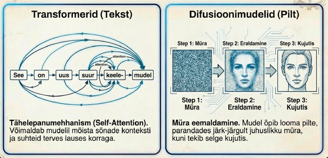
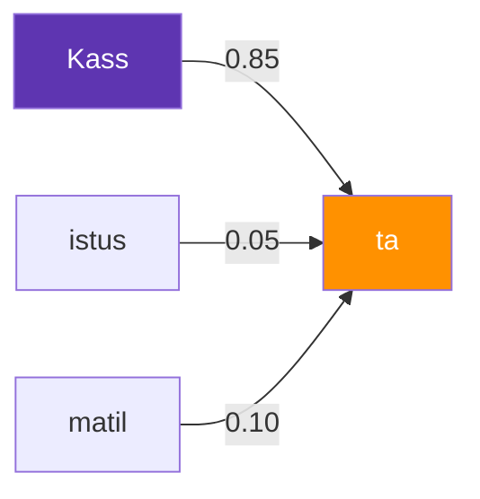
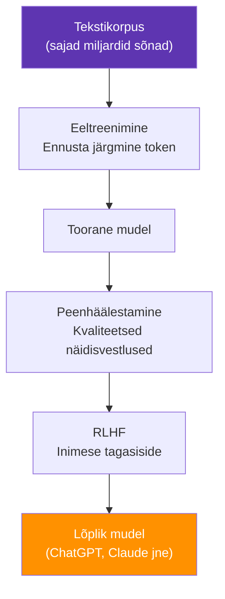

---
tags:
  - LLM
  - Transformer
---

# 3. Suurte keelemudelite taust

<figure markdown="span">
  
  <figcaption>Joonis 3.1. Transformerite ja difusioonimudelite tehnoloogiline arhitektuur (Talvik, 2025). Loodud tehisintellekti abil.</figcaption>
</figure>

!!! abstract "Eesmärgid"
    - Oskan selgitada, mis on suur keelemudel (LLM) ja kuidas see teksti genereerib
    - Mõistan Transformer-arhitektuuri põhiideed (tähelepanumehhanism)
    - Tean, mis on tokeniseerimine ja miks see oluline on
    - Oskan selgitada, kuidas LLM-e treenitakse (eeltreenimine ja peenhäälestamine)
    - Mõistan LLM-ide piiranguid: hallutsinatsioonid, kontekstiaken, teadmiste lõikekuupäev

## Keelemudelite idee

Mis juhtub, kui kirjutad telefoni sõnumi ja telefon pakub järgmist sõna? See väike funktsioon on kõige lihtsam keelemudel — süsteem, mis ennustab tõenäosuse põhjal, milline sõna tuleb järgmisena.

Nüüd skaleeri seda ideed miljardi korra. Anna mudelile lugeda kogu internet — Vikipeedia, raamatud, foorumid, kood, teadusartiklid. Las ta õpib, kuidas sõnad ja laused omavahel seostuvad. Tulemus on **suur keelemudel** (*Large Language Model*, LLM) — süsteem, mis suudab genereerida teksti, mis on nii loomulik, et seda on raske eristada inimese kirjutatust.[^llm_survey]

!!! info "Oluline mõistmine"
    LLM ei "tea" midagi selles mõttes, nagu inimene teab. Ta on näinud statistilisi mustreid triljonites sõnades ja oskab neid mustreid reprodutseerida. Kui küsid "Mis on Eesti pealinn?", ei otsi ta mälust fakti — ta genereerib sõna "Tallinn", sest see järgneb statistiliselt kõige tõenäolisemalt sellele küsimusele.

## Transformer — arhitektuur, mis muutis kõike

Enne 2017. aastat kasutati keelemudelites rekurrentseid närvivõrke (RNN), mis töötlesid teksti sõna-sõna-haaval, järjekorras. See oli aeglane ja pikad laused kaotasid alguse "meelest ära."

2017. aastal avaldasid Google'i teadlased artikli pealkirjaga "Attention Is All You Need"[^transformer] ja esitlesid **Transformer**-arhitektuuri. See idee muutis kogu valdkonda ja on tänaste LLM-ide alus — nii GPT, Claude, Gemini kui Llama kasutavad kõik Transformer-arhitektuuri variatsioone.

### Tähelepanumehhanism (*Attention*)

Transformeri geniaalne idee on **tähelepanumehhanism** (*self-attention*). Selle asemel, et lugeda teksti algusest lõpuni nagu raamatut, vaatab Transformer *kõiki sõnu korraga* ja arvutab, kui palju iga sõna peaks "tähelepanu pöörama" igale teisele sõnale.

Näide lausega: "Kass istus matil, sest **ta** oli väsinud."

Inimesele on selge, et "ta" viitab kassile. Aga kuidas seda masinale õpetada? Tähelepanumehhanism arvutab iga sõnapaari jaoks skoori — ja leiab, et "ta" on kõige tugevamalt seotud sõnaga "kass". Seega, kui mudel genereerib lauset edasi, "teab" ta, et jutt käib kassist.

<figure markdown="span">



  <figcaption>Joonis 3.1. Tähelepanumehhanismi lihtsustatud skeem — "ta" pöörab kõige rohkem tähelepanu sõnale "kass" (Talvik, 2026).</figcaption>
</figure>

### Miks Transformer võitis

| Omadus | RNN (vana) | Transformer (uus) |
|---|---|---|
| Töötlus | Sõna-sõna-haaval, järjekorras | Kõik sõnad korraga (paralleelselt) |
| Pikad laused | Kaotab alguse meelest | Tähelepanu ulatub kogu tekstile |
| Treenimine | Aeglane (järjestikune) | Kiire (paralleliseeritav GPU-del) |
| Skaleerimine | Piiratud | Skaleerub hästi — rohkem parameetreid = parem |

*Tabel 3.1. RNN vs Transformer*

Transformeri kiirus tuli sellest, et kogu sisendteksti saab töödelda paralleelselt — GPU-d suudavad tuhandeid maatrikskorrutamisi teha samal ajal. See tegi võimalikuks mudelite kasvatamise miljarditesse parameetritesse.

??? question "🤔 Mõtle kaasa"
    Kui LLM genereerib teksti järgmist sõna ennustades, siis miks ta mõnikord väga "tarku" asju ütleb — näiteks lahendab matemaatikaülesandeid või kirjutab koodi? Kas see on lihtsalt "papagoi" efekt?

    ??? tip "Vihje"
        Mõtle sellele, KUI palju teksti mudel on näinud. Kui sa oleksid lugenud *kogu* interneti, kõik raamatud ja kogu StackOverflow — kas sa suudaksid ka "lihtsalt" järgmist sõna ennustades midagi tarka öelda?

    ??? success "Vastus"
        See on mastaabi küsimus. Kui mudel on triljoneid sõnu analüüsinud, sisaldavad need statistilised mustrid ka loogikat, koodi struktuure ja matemaatilist arutlust. Mudel ei "mõista" neid — aga ta on õppinud reprodutseerima mustreid, mis *näevad välja* nagu mõistmine. See ongi AI tugevus ja nõrkus korraga: mõnikord tulemused on geniaalsed, mõnikord on geniaalselt valesti.

## Tokeniseerimine

LLM ei loe teksti tähthaaval ega sõnahaaval — ta jagab selle **tokeniteks**. Token on tükk teksti, mis võib olla terve sõna, sõnaosa, number või isegi kirjavahemärk.

Näiteks lause "Tehisintellekt muudab maailma" tokeniseeritakse umbes nii:

```text
["Tehis", "intellekt", " muud", "ab", " maailma"]
```

Miks mitte terved sõnad? Sest keeltes on liiga palju erinevaid sõnavorme. Eesti keeles on sõnal "arvuti" vormid "arvutit", "arvutiga", "arvutitest", "arvutitele"... Tokeniseerimine aitab mudelil tulla toime sõnadega, mida ta pole täpselt sellisel kujul varem näinud, jagades need tuttavateks osadeks.

!!! tip "Miks tokenid on IT-spetsialistile olulised"
    Tokenite arv määrab, kui palju teksti LLM korraga "näeb" ja kui palju API päring maksab. Kui tead, et üks token ≈ 4 tähemärki (inglise keeles) ja sinu küsimus koos vastusega on 2000 tokenit, oskad arvutada API kulu. Eesti keeles kulub rohkem tokeneid, sest morfoloogia on keerukam.

## Kuidas LLM-e treenitakse

LLM-i treenimine toimub kahes põhietapis.

### Eeltreenimine (*Pre-training*)

Mudelile antakse hiigelsuur tekstikorpus — sajad miljardid sõnad internetist, raamatutest, koodist. Ülesanne on lihtne: **ennusta järgmine token.** Mudel loeb lause algust ja proovib ennustada, mis tuleb järgmiseks. Kui ennustus on vale, kohandatakse kaalusid. Seda korratakse triljoneid kordi.

See etapp nõuab tohutut arvutusvõimsust — tuhandeid GPU-sid nädalate kaupa. GPT-4 treenimise hinnanguline maksumus oli üle 100 miljoni dollari.[^training_cost]

### Peenhäälestamine ja RLHF

Pärast eeltreenimist on mudel "tark", aga "metsik" — ta genereerib teksti, mis on statistiliselt usutav, aga ta ei tea, kuidas olla kasulik, viisakas ja ohutu.

**Peenhäälestamine** (*fine-tuning*) tähendab mudeli treenimist väiksemal, kvaliteetsemal andmekogumisel — näiteks näidisvestlustel, kus inimene küsib ja assistent vastab korralikult.

**RLHF** (*Reinforcement Learning from Human Feedback*) on järgmine samm. Inimhindajad loevad mudeli vastuseid ja hindavad neid: "See vastus on parem kui too." Mudelit treenitakse siis eelistama vastuseid, mida inimesed paremaks pidasid. Nii saab mudelist "viisakas assistent" selle asemel, et olla lihtsalt teksti generaator.

<figure markdown="span">



  <figcaption>Joonis 3.2. LLM-i treenimise kolm etappi (Talvik, 2026).</figcaption>
</figure>

## LLM-ide piirangud

LLM-id on muljetavaldavad, kuid kaugeltki mitte täiuslikud. Nende piirangute tundmine on kriitiline, sest muidu usaldad süsteemi rohkem, kui ta väärib.

### Hallutsinatsioonid

LLM genereerib teksti, mis *näeb välja* usutav, aga on faktiliselt vale. Ta võib välja mõelda tsitaate, viiteid, statistikat ja isegi inimesi, keda pole olemas. See juhtub, sest mudel ei "kontrolli fakte" — ta genereerib statistiliselt tõenäolise jätku, ja mõnikord on see jätk vale.

!!! danger "Reaalne juhtum"
    2023. aastal kasutasid kaks USA advokaati ChatGPT-d kohtuasja ettevalmistamisel. LLM genereeris viited kuuele kohtulahendile — millest mitte ükski ei eksisteerinud. Advokaadid esitasid need kohtule, said rahaliselt trahvitud ja juhtum sai rahvusvaheliseks uudiseks. Alati kontrolli LLM-i väljundit.[^hallucination]

### Kontekstiaken

LLM suudab korraga "näha" piiratud hulga teksti — seda nimetatakse **kontekstiaknaks** (*context window*). Praeguste mudelite kontekstiaknad ulatuvad 100 000 kuni 1 000 000 tokenini, aga sellel on piir. Kui vestlus muutub väga pikaks, "unustab" mudel alguse.

### Teadmiste lõikekuupäev (*Knowledge Cutoff*)

LLM-i "teadmised" pärinevad treenimisandmetest, millel on kindel kuupäev. Mudel ei tea, mis maailmas pärast seda kuupäeva juhtus — välja arvatud juhul, kui tal on ligipääs veebiotsingule.

### Matemaatika ja loogika

!!! bug "🔍 AI eksis — leia viga"
    **Küsimus AI-le:** "Mitu r-tähte on sõnas Strawberry?"

    **AI vastas:** *"Sõnas 'Strawberry' on 2 r-tähte."*

    Kas see on õige?

    ??? tip "Analüüs"
        See on **vale**. Sõnas "Strawberry" on 3 r-tähte: st**r**awbe**rr**y. AI eksis, sest ta ei "näe" tähti — ta töötleb sõnu tokenitena, mitte üksikute tähemärkidena. Sõna "Strawberry" on tema jaoks üks terviklik märgijada, mitte rida üksikuid tähti.

        Sama põhjus: AI väidab vahel, et 9.11 > 9.9 — ta töötleb numbreid tekstina, mitte matemaatilise väärtusena.

        **Kasuta → Kahtlusta → Kontrolli:** AI andis vastuse, aga lihtne käsitsi loendamine paljastab vea. Alati kontrolli tulemust, eriti kui see puudutab arve ja loendamist.

LLM-id on halvad matemaatikas. Nad genereerivad teksti, mitte ei arvuta. Lihtne tehe `7849 × 3721` võib anda vale vastuse, sest mudel "ennustab" tulemust, mitte ei korruta numbreid. Seetõttu kasutavad tänased süsteemid eraldi arvutustööriistu (koodi käitamine, kalkulaator).

??? question "🤔 Mõtle kaasa"
    AI-d nimetatakse vahel "Gutenbergi pärijaks" — ta on sündinud tekstist. Ta teab, mis on lõhn, sest ta on lugenud miljoneid kirjeldusi, aga ta ei *tunne* seda. Kuidas see mõjutab AI usaldusväärsust erinevates valdkondades — tekstis vs füüsilises maailmas?

    ??? tip "Vihje"
        Mõtle: miks teeb AI head tõlget, aga autonoomne auto vajab ikka veel inimjuhti? Mõlemad kasutavad närvivõrke.

    ??? success "Vastus"
        Tõlge on puhtalt keeleline ülesanne — siin on AI oma elemendis, sest ta on treenitud tekstil. Aga autojuhtimine nõuab füüsilise maailma *tunnetamist* — intuitiivset mõistmist, et peatunud takso taga võib olla teeületaja. AI-l puudub see bioloogiline "kehamälu". Seepärast on AI tekstitöötluses üliinimlik, aga füüsilises maailmas ebakindel.

---

## Kriitiline mõtlemine

??? question "Stsenaarium 1: Kas sa usaldaksid AI-d meditsiinilise diagnoosiga?"
    Sa oled arsti juures ja arst ütleb: "Ma lasin Claude'il sinu analüüsitulemused läbi vaadata ja AI arvab, et see on X haigus." Arst ei kontrollinud tulemust ise.

    Kuidas sa reageeriksid? Kas AI meditsiinilised soovitused peaksid olema lubatud?

    ??? tip "Kaalumiseks"
        Mõtle kahele poolele: (1) AI suudab analüüsida tuhandeid teadusartikleid sekunditega — arst ei suuda seda kunagi. (2) AI hallutsineerib ja tal puudub kliiniline kogemus — ta pole kunagi patsienti näinud.

        Võti on *koostöö*: AI kui "teine arvamus", mida arst kontrollib. Mitte AI kui lõplik otsustaja.

??? question "Stsenaarium 2: Kolleeg genereeris raportist kokkuvõtte"
    Kolleeg palus Claude'il teha kokkuvõtte 50-leheküljelisest turvaraportist. AI genereeris lühikese kokkuvõtte, mis kõlas väga professionaalselt. Kolleeg saatis selle juhtkonnale ilma kontrollimata.

    Hiljem selgub, et AI jättis kokkuvõttest välja kriitilise turvanõrkuse, sest see oli dokumendi keskel ja AI "keskendus" algusele ja lõpule.

    Mida oleks pidanud teisiti tegema?

    ??? tip "Kaalumiseks"
        Kontekstiaken on piiratud. Isegi kui mudel "näeb" kogu dokumenti, ei pruugi ta kõiki detaile võrdselt kaaluda. Kriitilist dokumenti ei tohi kunagi kokkuvõtta ainult AI-ga — inimene peab kontrollima, kas olulised punktid on kaetud.

---

## Kokkuvõte

Suured keelemudelid (LLM) on ehitatud Transformer-arhitektuuril, mille võti on tähelepanumehhanism — võime kaaluda iga sõna seost iga teise sõnaga tekstis. LLM-e treenitakse kahes etapis: eeltreenimisel ennustab mudel triljoneid kordi järgmist tokenit, peenhäälestamisel ja RLHF-iga kohandatakse ta käituma abivalmis assistendina. Tokeniseerimine jagab teksti tükkideks, mille arv määrab kontekstiakna kasutuse ja API kulu. LLM-idel on olulised piirangud: hallutsinatsioonid (väljamõeldud faktid), piiratud kontekstiaken, teadmiste lõikekuupäev ja nõrk matemaatika.

---

## Enesekontroll

??? question "1. Kuidas LLM teksti genereerib?"
    ??? tip "Vihje"
        Mõtle telefoni autocompletele. Mis juhtub, kui seda skaleerida miljardi korda?

    ??? success "Vastus"
        LLM ennustab järgmist tokenit (sõna või sõnaosa) tõenäosuse põhjal. Ta on treenimise käigus näinud triljoneid sõnu ja õppinud statistilised mustrid — milline sõna järgneb milliste sõnade järel kõige tõenäolisemalt. Ta ei "mõtle" ega "otsi fakte" — ta genereerib statistiliselt usutava jätku.

??? question "2. Mis on tähelepanumehhanism ja miks see oluline on?"
    ??? tip "Vihje"
        Mõtle lausele: "Kass istus matil, sest ta oli väsinud." Kuidas teab masin, et "ta" viitab kassile?

    ??? success "Vastus"
        Tähelepanumehhanism (*self-attention*) võimaldab mudelil vaadata kõiki sõnu sisendtekstis korraga ja arvutada, kui palju iga sõna peaks "tähelepanu pöörama" igale teisele sõnale. See lahendab pikkade lausete probleemi — erinevalt varasematest RNN-idest ei kaota Transformer pika teksti algust "meelest ära." Samuti võimaldab see paralleeltöötlust GPU-del, mis tegi võimalikuks mudelite skaleerimise miljarditesse parameetritesse.

??? question "3. Miks LLM-id hallutsineerivad?"
    ??? tip "Vihje"
        Mis on LLM-i *tegelik* ülesanne? Ta ei õpi fakte — ta õpib midagi muud.

    ??? success "Vastus"
        LLM ei kontrolli fakte — ta genereerib teksti, mis on statistiliselt tõenäoline. Kui küsid midagi, mille kohta mudelil on piisavalt konteksti, on vastus tihti õige. Aga kui küsid midagi spetsiifilist, haruldast või äärmuslikku, võib mudel genereerida usutavalt kõlava, kuid faktiliselt vale vastuse — sest tema eesmärk on tõenäoline jätk, mitte tõene jätk.

??? question "4. Miks on tokenite mõistmine praktiline?"
    ??? tip "Vihje"
        Mõtle API arve peale. Mis ühik seal on?

    ??? success "Vastus"
        Tokenite arv määrab kaks praktilist asja: (1) kui palju teksti LLM korraga "näeb" (kontekstiaken) ja (2) kui palju API päring maksab (hind arvutatakse tokenite järgi). Eesti keeles kulub rohkem tokeneid kui inglise keeles, sest morfoloogia on keerukam — iga sõnavorm tokeniseeritakse eraldi tükkideks.

??? question "5. Mis vahe on eeltreenimisel ja peenhäälestamisel?"
    ??? tip "Vihje"
        Mõtle analoogiale: eeltreenimine = raamatute lugemine. Peenhäälestamine = ???

    ??? success "Vastus"
        Eeltreenimisel antakse mudelile hiigelsuur tekstikorpus (sajad miljardid sõnad internetist) ja ta õpib ennustama järgmist tokenit. Tulemus on "tark, aga metsik" mudel. Peenhäälestamisel treenitakse mudelit väiksemal, kvaliteetsemal andmekogumisel (näidisvestlused), et ta õpiks olema kasulik ja viisakas. RLHF-iga lisatakse inimhindajate tagasiside, et mudel eelistaks paremaid vastuseid.

[^llm_survey]: Zhao, W. X. et al. (2023). *A Survey of Large Language Models*. arXiv:2303.18223. https://arxiv.org/abs/2303.18223
[^transformer]: Vaswani, A. et al. (2017). Attention Is All You Need. *Advances in Neural Information Processing Systems*, 30. https://arxiv.org/abs/1706.03762
[^training_cost]: Cottier, B. et al. (2024). The rising costs of training frontier AI models. *Epoch AI*. https://epoch.ai/blog/training-cost-trends
[^hallucination]: Weiser, B. (2023). Here's What Happens When Your Lawyer Uses ChatGPT. *The New York Times*. https://www.nytimes.com/2023/05/27/nyregion/avianca-chatgpt-fake-citations.html
