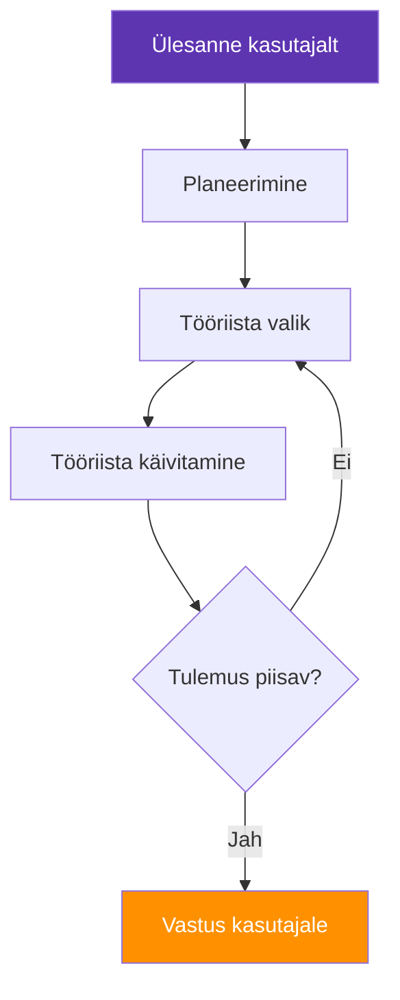
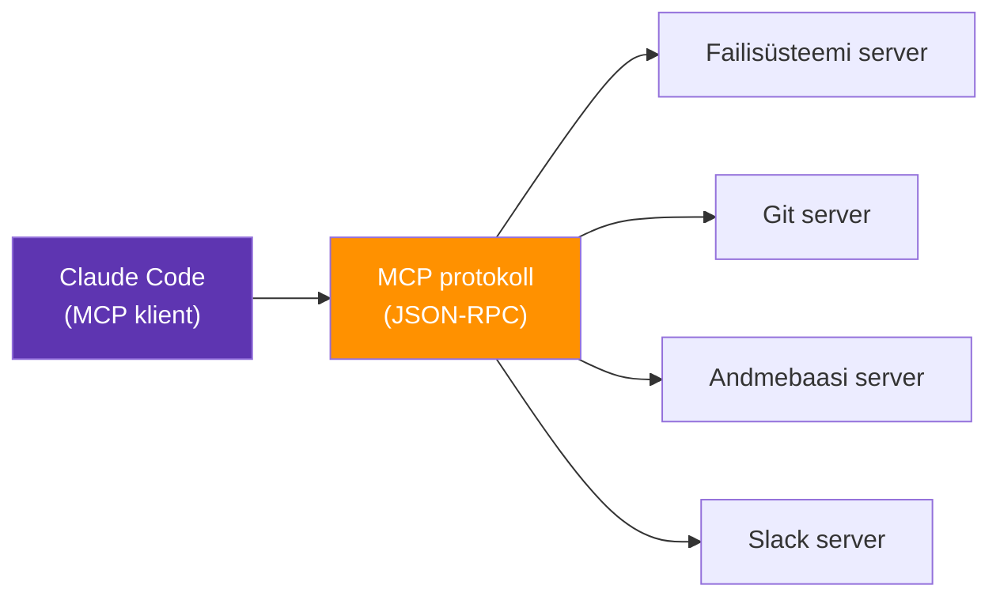

---
tags:
  - Agendid
  - MCP
  - AI
  - Tööriistad
---

# 7. Agentlik töövoog

!!! abstract "Eesmärgid"
    - Oskan selgitada, mis on AI agent ja kuidas see erineb tavalisest vestlusrobotist
    - Mõistan agentliku töövoo põhiideed: planeerimine, tööriistade kasutamine, iteratsioon
    - Tean, mis on MCP (Model Context Protocol) ja miks see on oluline
    - Oskan kirjeldada reaalseid näiteid agentlikest süsteemidest IT-valdkonnas
    - Mõistan agentlike süsteemide riske ja piiranguid

## Vestlusrobotist agendiks

Tavaline vestlusrobot töötab nii: sa küsid, ta vastab. Üks voor, üks vastus. Kui vastus on vale, küsid uuesti. Kogu mõtlemine ja otsustamine on sinu peal.

**AI agent** on midagi muud. Agent saab ülesande, *planeerib* sammud, kasutab *tööriistu* (veebiotsing, koodikirjutamine, failide lugemine, API päringud), hindab tulemust ja *itereerib* — kordab sammu, kui tulemus pole piisav. Sa annad ülesande ja agent teeb mitu sammu iseseisvalt.

Mõtle vestlusrobotist kui kalkulaatorist — sa vajutad nuppe ja saad vastuse. Agent on rohkem nagu praktikant — sa annad ülesande ja ta läheb tegema, tuleb küsimustega tagasi ja annab lõpptulemuse.

<figure markdown="span">

  <figcaption>Joonis 7.1. Agentlik tsükkel — planeeri, kasuta tööriista, hinda, korda (Talvik, 2026).</figcaption>
</figure>

## Agendi komponendid

Iga AI agent koosneb kolmest põhiosast:

### LLM kui "aju"

Agent kasutab LLM-i otsuste tegemiseks. LLM loeb ülesannet, mõtleb, milline samm on järgmine, ja otsustab, millist tööriista kasutada. See on "mõtlemise" kiht.

### Tööriistad (*Tools*)

Agent saab kasutada väliseid tööriistu: veebiotsingut, faili lugemist ja kirjutamist, API päringuid, andmebaasi päringuid, koodi käivitamist. Ilma tööriistadeta on agent lihtsalt vestlusrobot — tööriistadega muutub ta tegijaks.

### Mälu ja kontekst

Agent peab meeles, mida ta on juba teinud, millised tulemused ta sai ja milline on ülesande hetkeseis. See võimaldab tal itereerida — kui esimene lähenemine ei tööta, proovib ta teist.

!!! info "Näide: Claude Code kui agent"
    Annad Claude Code'ile ülesande: "Leia ja paranda kõik SQL-süsti haavatavused selles projektis." Agent: (1) loeb projekti failid läbi, (2) tuvastab SQL-päringuid sisaldavad failid, (3) analüüsib iga päringut, (4) leiab parameetriteta päringud, (5) kirjutab paranduse, (6) käivitab testid, (7) annab kokkuvõtte. Sa ei pidanud iga sammu käsitsi juhtima.

## MCP — Model Context Protocol

**MCP** (*Model Context Protocol*) on Anthropicu loodud avatud standard, mis lahendab agentide ühe suurima probleemi: kuidas ühendada LLM välismaailmaga struktureeritud viisil.[^mcp]

Ilma MCP-ta peab iga tööriista integratsioon olema eraldi programmeeritud. Tahad, et agent loeks Google Drive'i faile? Kirjuta integratsioon. Tahad, et ta loeks Slacki sõnumeid? Kirjuta teine integratsioon. Iga kombinatsioon nõuab eraldi tööd.

MCP standardiseerib selle. See defineerib, kuidas agent ja tööriist omavahel suhtlevad — millist formaati nad kasutavad, kuidas agent tööriista avastab ja kuidas tulemused tagastatakse. Tulemus: kirjuta tööriist ühe korra ja see töötab iga MCP-toetava agendiga.

### MCP arhitektuur

MCP kasutab klient-server mudelit:

- **MCP klient** — agent (nt Claude Code), kes tahab tööriista kasutada
- **MCP server** — tööriist, mis pakub konkreetset funktsionaalsust (nt failisüsteemi lugemine, andmebaasi päring, API kutse)
- **Protokoll** — JSON-RPC põhine suhtlusstandard nende vahel

<figure markdown="span">

  <figcaption>Joonis 7.2. MCP arhitektuur — üks klient, mitu serverit (Talvik, 2026).</figcaption>
</figure>

### Miks MCP oluline on

| Ilma MCP-ta | MCP-ga |
|---|---|
| Iga tööriist vajab eraldi integratsiooni | Üks standard kõigile tööriistadele |
| N agenti × M tööriista = N×M integratsiooni | N agenti × M tööriista = N+M integratsiooni |
| Suletud ökosüsteemid | Avatud standard, iga arendaja saab teha |
| Agent näeb ainult teksti | Agent saab lugeda faile, pärida andmebaase, otsida veebist |

*Tabel 7.1. Integratsioon ilma MCP-ta vs MCP-ga*

### MCP näiteserverid

Anthropic ja kogukond on loonud hulga valmis MCP-servereid, mida saab kohe kasutada. Ametlik repositoorium asub aadressil [github.com/modelcontextprotocol/servers](https://github.com/modelcontextprotocol/servers) (Apache 2.0 litsents) ja sisaldab referentsimplementatsioone:[^mcp_servers]

| Server | Kirjeldus | Kasutuskoht |
|---|---|---|
| **Filesystem** | Failide lugemine, kirjutamine, otsimine | Lokaalne töö failidega |
| **Git** | Git-repositooriumi analüüs, ajaloo pärimine | Koodibaasi haldamine |
| **Fetch** | Veebilehtede sisu allalaadimine | Info kogumine veebist |
| **Memory** | Teadmusgraafil põhinev mälu | Pikaajaline konteksti hoidmine |
| **Sequential Thinking** | Samm-sammuline probleemilahendamine | Keerukas arutlus |

*Tabel 7.2. MCP referentsserverid repositooriumis modelcontextprotocol/servers*

Lisaks on olemas kogukonna loodud serverid populaarsetele teenustele: Slack, Google Drive, PostgreSQL, GitHub ja paljud teised. Kõik on avatud lähtekoodiga — saad neid uurida, kohandada ja oma servereid luua.

!!! tip "Proovi ise"
    Praktikumis 6 paigaldad MCP-serveri ja ühendad selle Claude Code'iga. Nii saad ise näha, kuidas agent tööriistaga suhtleb.

## Reaalsed näited IT-valdkonnas

**Intsidendi uurimine.** Agent saab teate: "Server X ei vasta." Ta: (1) kontrollib serveri staatust monitooringust, (2) loeb viimaseid logisid, (3) kontrollib ketaste ja mälu kasutust, (4) võrdleb viimatiste muudatustega (Git log), (5) koostab raporti koos tõenäolise põhjuse ja lahendusettepanekuga.

**Koodibaasi migratsioon.** "Muuda kõik Python 2 printlaused Python 3 formaati." Agent navigeerib kogu koodibaasis, leiab muutmist vajavad kohad, teeb muudatused ja käivitab testid.

**Infrastruktuuri audit.** "Kontrolli, kas kõik meie serverid vastavad CIS benchmark standarditele." Agent käivitab kontrollskriptid, kogub tulemused, võrdleb standardiga ja genereerib auditi raporti.

**Dokumentatsiooni uuendamine.** "Uuenda README failid vastavalt viimastele koodimuudatustele." Agent loeb Git log'i, tuvastab muutunud komponendid ja uuendab dokumentatsiooni.

## Riskid ja piirangud

Agentlikud süsteemid on võimsad, aga ka riskantsed. Mida rohkem autonoomiat agendile anda, seda suurem on potentsiaalne kahju.

**Vead võimenduvad.** Kui agent teeb vea sammus 3, mõjutab see kõiki järgnevaid samme. Vestlusroboti vale vastus on lihtsalt vale tekst — agendi vale samm võib tähendada kustutatud faile, valesti seadistatud servereid või lekkinud andmeid.

**Hallutsinatsioonid tegudes.** Agent ei hallutsineri ainult teksti — ta võib hallutsineerida *tegevusi*. Ta võib otsustada käivitada käsu, mida sa ei palunud, või teha API päringu valele endpointile.

**Ligipääsu kontroll.** Agent vajab ligipääsu tööriistadele — failisüsteemile, andmebaasidele, API-dele. Mida laiemad õigused, seda suurem risk. *Alati* piira agendi ligipääsu miinimumiga.

!!! danger "Põhireegel"
    Ära anna agendile rohkem ligipääsu, kui ta vajab konkreetse ülesande jaoks. Ära lase agendil teha pöördumatuid tegevusi (kustutamine, avaldamine) ilma inimese kinnituseta. See on sama põhimõte nagu *least privilege* — minimaalne ligipääs, mis on vajalik töö tegemiseks.

---

## Kokkuvõte

AI agendid erinevad vestlusrobotitest selle poolest, et nad suudavad planeerida, kasutada tööriistu ja itereerida iseseisvalt. Agent koosneb LLM-ist (otsustamine), tööriistadest (tegutsemine) ja mälust (konteksti hoidmine). MCP on avatud standard, mis standardiseerib agendi ja tööriistade vahelise suhtluse — üks integratsioon töötab kõigi MCP-toetavate klientidega. Ametlik referentsserverite repositoorium sisaldab valmislahendusi failide, Giti, veebi ja mälu jaoks. IT-valdkonnas on agentlikud süsteemid kasulikud intsidendi uurimisel, koodibaasi migreerimisel ja infrastruktuuri auditil. Peamine risk on vigade võimendumine ja kontrollimatu autonoomia — agendi ligipääs tuleb alati piirata miinimumiga.

---

## Enesekontroll

??? question "1. Mis vahe on vestlusrobotil ja AI agendil?"
    ??? success "Vastus"
        Vestlusrobot töötab ühe vooru kaupa: sa küsid, ta vastab. Agent saab ülesande ja teeb mitu sammu iseseisvalt: planeerib, valib tööriista, käivitab selle, hindab tulemust ja kordab vajadusel. Agent suudab kasutada väliseid tööriistu (failide lugemine, API päringud, veebiotsing), mida vestlusrobot ei suuda.

??? question "2. Mis on MCP ja millise probleemi see lahendab?"
    ??? success "Vastus"
        MCP (Model Context Protocol) on avatud standard, mis standardiseerib suhtluse AI agendi ja väliste tööriistade vahel. Ilma MCP-ta vajab iga agendi ja tööriista kombinatsioon eraldi integratsiooni (N×M). MCP-ga piisab N+M integratsioonist — iga tööriist kirjutatakse ühe korra ja töötab kõigi MCP-toetavate agentidega.

??? question "3. Millised on agentlike süsteemide peamised riskid?"
    ??? success "Vastus"
        (1) Vead võimenduvad — viga ühes sammus mõjutab kõiki järgnevaid. (2) Hallutsinatsioonid tegudes — agent võib teha tegevusi, mida ei palutud, näiteks käivitada vale käsu. (3) Ligipääsu risk — liiga laiad õigused tähendavad, et agendi viga võib põhjustada suuremat kahju (kustutatud failid, lekkinud andmed). Lahendus on *least privilege* põhimõte.

??? question "4. Millest koosneb AI agent?"
    ??? success "Vastus"
        Agent koosneb kolmest põhiosast: (1) LLM kui "aju" — teeb otsuseid, planeerib järgmist sammu, valib tööriista; (2) tööriistad — failide lugemine, API päringud, veebiotsing, koodi käivitamine; (3) mälu ja kontekst — peab meeles, mida on juba tehtud ja millised tulemused saadi, et vajaduse korral itereerida.

??? question "5. Too näide, kuidas AI agent IT-intsidenti uurib."
    ??? success "Vastus"
        Agent saab teate "Server X ei vasta" ja tegutseb iseseisvalt: (1) kontrollib serveri staatust monitooringust, (2) loeb viimaseid logisid, (3) kontrollib ketaste ja mälu kasutust, (4) vaatab viimaseid muudatusi Git logist, (5) koostab raporti tõenäolise põhjuse ja lahendusettepanekuga. Inimene ei pidanud iga sammu käsitsi juhtima.

[^mcp]: Anthropic. (2024). *Introducing the Model Context Protocol*. https://www.anthropic.com/news/model-context-protocol
[^mcp_servers]: Model Context Protocol. (2024). *MCP Servers — Reference Implementations*. GitHub. https://github.com/modelcontextprotocol/servers
