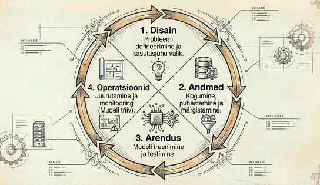
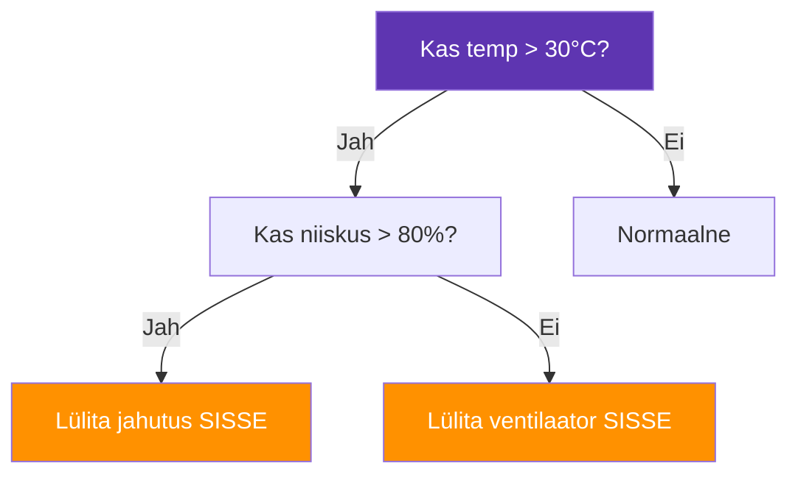
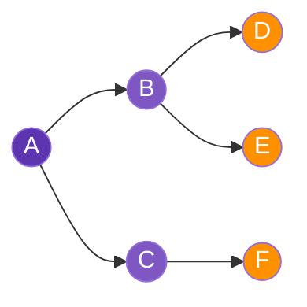

---
tags:
  - Algoritmid
  - Andmestruktuurid
  - AI
  - Masinõpe
---

# 8. Andmestruktuurid ja algoritmid AI kontekstis

<figure markdown="span">
  
  <figcaption>Joonis 8.1. AI projekti elutsükkel (Talvik, 2025). Loodud tehisintellekti abil.</figcaption>
</figure>

!!! abstract "Eesmärgid"
    - Oskan selgitada, miks andmestruktuurid ja algoritmid on AI süsteemide alus
    - Tean peamisi andmestruktuure, mida AI-s kasutatakse: massiivid, graafid, puud, paisktabelid
    - Mõistan klassikalisi otsingualgoritme: lineaarne otsing, kahendotsing, graafiotsing (BFS, DFS)
    - Oskan formuleerida otsinguülesande ja valida sobiva algoritmi
    - Mõistan, kuidas need kontseptsioonid seostuvad tänapäeva AI süsteemidega

## Miks see peatükk selles kursuses on?

Tehisintellekt ei ole maagia — see on matemaatika ja algoritmid. Iga kord, kui LLM genereerib teksti, ennustab masinõppemudel tulemust või agent valib järgmist sammu, töötavad taustal andmestruktuurid ja algoritmid. Nende mõistmine aitab aru saada, *miks* AI töötab nii nagu ta töötab — ja miks ta mõnikord ei tööta.

Sa ei pea olema algoritmiekspert, aga sa pead mõistma põhimõtteid. See on nagu autojuhtimiseks — sa ei pea teadma, kuidas sisepõlemismootor füüsikaliselt töötab, aga sa pead teadma, miks auto mäest üles aeglasemalt sõidab.

## Andmestruktuurid

Andmestruktuur on viis, kuidas andmed on organiseeritud mälus. Õige andmestruktuur teeb algoritmi kiireks, vale teeb aeglaseks. Siin on struktuurid, mis AI-s kõige rohkem rolli mängivad.

### Massiivid ja maatriksid

**Massiiv** (*array*) on lihtsaim — lihtsalt rida elemente, mis on mälus kõrvuti. Närvivõrgu sisendandmed (pilt, tekst, helisignaal) teisendatakse alati massiivideks enne, kui mudel neid töödelda saab.

**Maatriks** on kahemõõtmeline massiiv — read ja veerud. Transformer-arhitektuur (ptk 3) põhineb **maatrikskorrutamisel** — tähelepanumehhanismi arvutused on sisuliselt hiiglasuured maatrikskorrutamised, mida GPU-d suudavad paralleelselt teha.

!!! info "Miks GPU-d, mitte CPU-d?"
    CPU on hea ühe keeruka arvutuse kiireks tegemiseks. GPU on hea tuhandete lihtsate arvutuste *samaaegseks* tegemiseks. Maatrikskorrutamine on tuhandeid lihtsaid korrutamisi ja liitmisi — ideaalne GPU jaoks. Seepärast treenitakse AI mudeleid GPU-del (ja spetsiaalsetel TPU-del).

### Graafid

**Graaf** (*graph*) koosneb sõlmedest (*nodes*) ja servadest (*edges*), mis ühendavad sõlmi. Graafid on kõikjal: sotsiaalvõrgustikud (inimesed = sõlmed, sõprussuhted = servad), arvutivõrgud (seadmed = sõlmed, ühendused = servad), veebilehed (lehed = sõlmed, lingid = servad).

AI-s kasutatakse graafe teadmusgraafidena (*knowledge graphs*) — struktureeritud andmebaasid, kus faktid on esitatud sõlmede ja seoste kaudu. Näiteks: sõlm "Tallinn" — seos "on pealinn" — sõlm "Eesti". MCP mäluserver (ptk 7) kasutab teadmusgraafi info salvestamiseks.

### Puud

**Puu** (*tree*) on spetsiaalne graaf, kus pole tsükleid ja igal sõlmel (peale juure) on täpselt üks vanem. Puustruktuuri kasutavad otsustuspuud (ptk 2), mängupuud (AlphaGo strateegia), parsimispuud (loomuliku keele analüüs) ja failisüsteemid.

<figure markdown="span">



  <figcaption>Joonis 8.1. Otsustuspuu näide — serveriruumi jahutuse loogika (Talvik, 2026).</figcaption>
</figure>

### Paisktabelid

**Paisktabel** (*hash table*) võimaldab andmeid salvestada ja otsida konstantse ajaga — olenemata sellest, kui palju andmeid on. Võtme põhjal arvutatakse "aadress" ja andmed leitakse kohe.

AI-s kasutatakse paisktabeleid tokeniseerimises (sõna → tokeni ID otsimine), sõnavara haldamises ja kiiretes otsinguoperatsioonides.

| Andmestruktuur | Tugevus | AI kasutuskoht |
|---|---|---|
| Massiiv/maatriks | Kiire indeksipõhine ligipääs, paralleeltöötlus | Närvivõrgu kaalud, sisendandmed, maatrikskorrutamine |
| Graaf | Seoste modelleerimine | Teadmusgraafid, sotsiaalvõrgud, MCP mälu |
| Puu | Hierarhiline otsing, otsustamine | Otsustuspuud, mängupuud, parsimispuud |
| Paisktabel | Konstantse ajaga otsing | Tokeniseerimine, sõnavara, kiire otsing |

*Tabel 8.1. Andmestruktuurid ja nende roll AI-s*

## Otsinguülesanded

Otsing on informaatika üks fundamentaalsemaid probleeme ja AI süsteemid lahendavad otsinguülesandeid pidevalt.[^clrs] Otsinguülesande formuleerimine tähendab kolme asja defineerimist:

1. **Algseisund** — kust alustame?
2. **Eesmärk** — mida otsime?
3. **Lubatud sammud** — kuidas saame liikuda?

### Lineaarne otsing

Lihtsaim: vaata iga element läbi, kuni leiad õige. Toimib alati, aga on aeglane suurte andmehulkade puhul. Ajaline keerukus: O(n) — halvimal juhul vaatad kõik elemendid läbi.

```text
Ülesanne: Leia logifailist rida, mis sisaldab "ERROR"
Algoritm: Loe iga rida → kas sisaldab "ERROR"? → jah: leitud / ei: järgmine rida
```

### Kahendotsing (*Binary Search*)

Kui andmed on **sorteeritud**, saab otsida palju kiiremini. Vaata keskele — kas otsitav on suurem või väiksem? Viska pool andmetest ära ja korda. Iga sammuga pool andmetest kaob. Ajaline keerukus: O(log n) — miljon elementi tähendab maksimaalselt ~20 sammu.

```text
Ülesanne: Leia sorteeritud IP-aadresside nimekirjast, kas 192.168.1.50 on olemas
Algoritm: Vaata keskmine → 192.168.1.128 → otsitav on väiksem → vaata vasakut poolt →
          keskmine: 192.168.1.64 → otsitav on väiksem → ...
```

!!! tip "O-notatsioon lühidalt"
    O(n) tähendab: halvimal juhul kulub n sammu (andmehulga suurus). O(log n) tähendab: sammude arv kasvab logaritmiliselt — 1000 elemendiga ~10 sammu, miljoniga ~20. O(1) tähendab: alati sama kiire, olenemata andmehulgast (paisktabel).

### Graafiotsing: BFS ja DFS

Graafides on kaks klassikalist otsingualgoritmi:

**BFS** (*Breadth-First Search*) — laiuti otsing. Vaata kõigepealt kõiki naabersõlmi, siis naabrite naabreid ja nii edasi. Leiab alati lühima tee (vähimate sammudega). Kasulik: lühima marsruudi leidmine võrgus, naabrite otsimine sotsiaalvõrgustikus.

**DFS** (*Depth-First Search*) — sügavuti otsing. Mine nii sügavale kui saad, siis tagane ja proovi teist haru. Kasulik: kõigi võimalike teede leidmine, tsüklite tuvastamine, labürindi lahendamine.

<figure markdown="span">



  <figcaption>Joonis 8.2. BFS uurib kõigepealt B ja C (kiht 1), siis D, E, F (kiht 2) (Talvik, 2026).</figcaption>
</figure>

| Algoritm | Strateegia | Leiab lühima tee? | Mälukasutus | AI kasutuskoht |
|---|---|---|---|---|
| Lineaarne | Vaata kõik läbi | — | Minimaalne | Lihtne logiotsing |
| Kahendotsing | Pooli pidevalt | — | Minimaalne | Sorteeritud andmete otsing |
| BFS | Laiuti, kiht-kiht | Jah | Suur | Lühim marsruut, sotsiaalsed seosed |
| DFS | Sügavuti, haru-haru | Ei | Väike | Kõik teed, tsüklid, mängupuud |

*Tabel 8.2. Otsingualgoritmide võrdlus*

## Kuidas see seostub AI-ga?

**Närvivõrgud** on sisuliselt hiiglaslikud maatriksoperatsioonid — sisendvektor korrutatakse kaalumaatrksitega kiht-kihi haaval.

**Transformer** kasutab tähelepanumehhanismi, mis on maatrikskorrutamine: küsimuste, võtmete ja väärtuste maatriksid.

**Otsinguülesanded** on AI tuumik. Mängupuude otsing (AlphaGo), tõenäosusruumi otsing (LLM-i järgmise tokeni valimine), optimeerimisprobleemid (parimate parameetrite leidmine treenimise käigus) — kõik on otsinguülesanded.

**Tokeniseerimine** kasutab paisktabelit — iga token vastab numbrilisele ID-le, mida paisktabeli kaudu kiiresti otsitakse.

**MCP mälu** kasutab teadmusgraafi — faktid on sõlmed, seosed on servad, ja otsing graafis leiab seotud info.

---

## Kokkuvõte

Andmestruktuurid ja algoritmid on AI süsteemide taustal töötav mehhanism. Massiivid ja maatriksid on närvivõrkude arvutuste alus. Graafid modelleerivad seoseid teadmusgraafides ja sotsiaalvõrgustikes. Puud on otsustuspuude, mängupuude ja parsimispuude alus. Paisktabelid tagavad kiire otsingu tokeniseerimises ja sõnavara haldamises. Otsinguülesande formuleerimine (algseisund, eesmärk, lubatud sammud) on fundamentaalne oskus — BFS leiab lühima tee, DFS uurib kõiki võimalusi. Need ei ole abstraktsed akadeemilised kontseptsioonid, vaid konkreetsed mehhanismid, mis teevad AI süsteemid võimalikuks.

---

## Enesekontroll

??? question "1. Miks kasutab Transformer-arhitektuur maatrikskorrutamist?"
    ??? success "Vastus"
        Tähelepanumehhanism (*self-attention*) arvutab iga sõna seose iga teise sõnaga tekstis. See arvutus esitletakse maatrikskorrutamisena: küsimuste, võtmete ja väärtuste maatriksid korrutatakse omavahel. Maatrikskorrutamine on paralleliseeritav — GPU-d suudavad tuhandeid korrutamisi teha samal ajal, mis teeb Transformeri kiireks.

??? question "2. Mis vahe on BFS ja DFS otsingustrateegial?"
    ??? success "Vastus"
        BFS (laiuti otsing) uurib kõigepealt kõiki naabersõlmi, siis naabrite naabreid — see leiab alati lühima tee, aga kasutab rohkem mälu. DFS (sügavuti otsing) läheb ühe haru lõpuni, siis taganeb ja proovib teist — see kasutab vähem mälu, aga ei garanteeri lühimat teed.

??? question "3. Kuidas formuleerida otsinguülesannet?"
    ??? success "Vastus"
        Defineerida kolm asja: (1) algseisund — kust alustame, (2) eesmärk — mida otsime, (3) lubatud sammud — kuidas saame liikuda. Näide: algseisund = serveri A IP-aadress, eesmärk = jõuda serverini F, lubatud sammud = liikumine ühendatud serverite vahel. Siis saab valida algoritmi (BFS lühimaks teeks, DFS kõigi teede leidmiseks).

??? question "4. Miks on paisktabel tokeniseerimisel oluline?"
    ??? success "Vastus"
        Tokeniseerimisel tuleb iga sõna või sõnaosa kiiresti teisendada numbriliseks ID-ks. Paisktabel teeb seda konstantse ajaga — O(1) — olenemata sellest, kui suur sõnavara on. Ilma paisktabelita peaks iga tokeni jaoks kogu sõnavara läbi vaatama, mis oleks palju aeglasem.

??? question "5. Nimeta kolm AI süsteemi, mis kasutavad puustruktuuri."
    ??? success "Vastus"
        (1) Otsustuspuud masinõppes — mudel teeb otsuseid küsimuste jada kaudu. (2) Mängupuud (nt AlphaGo) — agent uurib võimalikke käike puustruktuuris. (3) Parsimispuud loomuliku keele töötluses — laused jaotatakse grammatilisteks komponentideks puustruktuurina.

[^clrs]: Cormen, T. H. et al. (2022). *Introduction to Algorithms* (4th ed.). MIT Press. https://mitpress.mit.edu/books/introduction-algorithms
