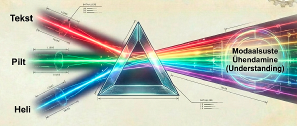

---
tags:
  - Trendid
  - AI
---

# 10. Tulevikutrendid

<figure markdown="span">
  
  <figcaption>Joonis 10.1. Tulevikuvisioon 2026–2036 (Talvik, 2025). Loodud tehisintellekti abil.</figcaption>
</figure>

!!! abstract "Eesmärgid"
    - Oskan kirjeldada peamisi AI arengusuundi: multimodaalsus, väikesed mudelid, agentlik AI
    - Mõistan, mis vahe on tänapäeva AI-l ja hüpoteetilisel AGI-l
    - Tean, kuidas AI mõjutab IT-spetsialisti rolli lähiaastatel
    - Oskan kriitiliselt hinnata AI hüpet (*hype*) ja tegelikkust
    - Mõistan elukestva õppe olulisust AI-ajastul

## Mis muutub ja mis jääb

AI valdkond liigub kiiresti — kuude, mitte aastate kaupa. 2022. aasta novembris oli ChatGPT uudne, 2024. aastal oli agentlik AI eksperimentaalne, 2026. aastal on MCP ja koodiagendid igapäevased tööriistad. See tempo ei aeglustu.

Aga mõned asjad jäävad samaks. Andmestruktuurid ja algoritmid (ptk 8) on samad, mis 50 aastat tagasi. Transformer-arhitektuur (ptk 3) on 2017. aastast ja domineerib tänaseni. Promptimise põhiprintsiibid (ptk 4) kehtivad olenemata mudelist. **Fundamentaalid on stabiilsed — rakendused muutuvad.**

## Multimodaalsus

Varajased LLM-id töötlesid ainult teksti. Tänased mudelid suudavad sisendina võtta teksti, pilte, heli, videot ja dokumente ning väljundina genereerida teksti, pilte ja koodi. Seda nimetatakse **multimodaalsuseks**.

Miks see IT-spetsialistile oluline on? Sa saad näiteks pildistada serveriruumi kaablipundart ja küsida: "Milline kaabel läheb kuhu?" Või salvestada veateate häälsõnumina ja saada tekstiline analüüs. Või laadida üles 200-leheküljelise tehnilise dokumentatsiooni PDF-i ja küsida konkreetseid küsimusi.

Multimodaalsus muudab AI sisuliselt kasulikumaks, sest reaalne maailm pole ainult tekst — see on pildid, helid, dokumendid ja video.

## Väikesed mudelid ja efektiivsus

Suurte mudelite trenn (GPT-4: 1,7 triljonit parameetrit) jõuab piirini — treenimine on kallis, energia kulu on tohutu ja latentsus on suur. Vastukaaluna areneb trend **väikeste, efektiivsete mudelite** suunas.

**Destilleerimine** (*distillation*) — suure mudeli teadmised kantakse üle väiksemasse mudelisse, mis on kiirem ja odavam, aga säilitab enamiku kvaliteedist. Näiteks Llama 3 8B on piisavalt hea paljudeks ülesanneteks, aga jookseb tavalises sülearvutis.

**Kvantiseerimine** (*quantization*) — mudeli parameetrite täpsust vähendatakse (nt 32-bit → 4-bit), mis vähendab mäluvajadust ja kiirendab tööd, vähese kvaliteedikaotusega.

**Spetsialiseeritud mudelid** — selle asemel et üks hiigelmudel teeks kõike, luuakse väiksemaid mudeleid konkreetsete ülesannete jaoks (koodi genereerimine, tõlkimine, meditsiiniline analüüs).

!!! tip "Miks väikesed mudelid IT-spetsialistile olulised on"
    Väikesed mudelid jooksevad lokaalses masinas (Ollama, ptk 5). See tähendab: (1) andmed ei lahku — privaatsus tagatud; (2) ei sõltu internetiühendusest; (3) ei maksa igakuist tellimust; (4) latentsus on madal. Kui su ülesanne ei nõua maailma parimat mudelit, on väike lokaalne mudel sageli parem valik.

## Agentlik AI

Ptk 7 kirjeldas agentide tööpõhimõtet. See trend kiireneab. 2026. aastal on agendid juba igapäevaselt kasutatavad (Claude Code, GitHub Copilot Workspace), aga need on veel varajases faasis.

Tuleviku suunad:

**Mitme agendi koostöö.** Ühe agendi asemel töötavad mitu agenti koos — üks uurib probleemi, teine kirjutab koodi, kolmas testib, neljas dokumenteerib. Iga agent on spetsialiseerunud.

**Pikaajaline mälu.** Praeguste agentide mälu on piiratud ühe sessiooniga. Tuleviku agendid mäletavad eelnevaid vestlusi, õpivad kasutaja eelistusi ja kohanduvad aja jooksul.

**Autonoomia kasv.** Agendid saavad rohkem iseseisvust — praegu kinnitab inimene iga sammu, tulevikus kinnitab ainult kriitilisi otsuseid. See tõstab efektiivsust, aga suurendab ka riske (ptk 7 ja 9).

## AGI: kus me oleme?

Kas üldine tehisintellekt (AGI, ptk 1) on lähedal? Ausalt — keegi ei tea. Arvamused jagunevad:

**Optimistid** (Sam Altman, Dario Amodei) arvavad, et AGI on 3–10 aasta kaugusel. Nad viitavad kiirele arengutempole ja sellele, et praegused mudelid on juba paljudes ülesannetes inimesest paremad.

**Skeptikud** (Yann LeCun, Gary Marcus) arvavad, et praegune lähenemine (rohkem andmeid + rohkem parameetreid) ei vii AGI-ni. Neil pole "maailmamõistmist" ega "tervet mõistust" — nad genereerivad statistiliselt usutavat teksti, aga ei *mõista* tegelikult midagi.

**Pragmaatikud** ütlevad: pole vahet, kas see on "päris" AGI või mitte — oluline on, mida süsteem *praktiliselt* suudab. Kui mudel lahendab sinu probleemi, on temast kasu, olenemata filosoofilistest aruteludest.

!!! info "IT-spetsialisti vaade"
    Sinu jaoks pole oluline, kas ja millal AGI tuleb. Oluline on, et *praegused* tööriistad muutuvad iga aastaga võimsamaks ja muudavad sinu tööd. Sellega kohanemiseks on vaja pidevalt õppida.

## Kuidas AI muudab IT-spetsialisti rolli

AI ei asenda IT-spetsialisti — ta muudab selle, mida spetsialist teeb.

**Rutiinne töö automatiseerub.** Skriptide kirjutamine, logide lugemine, dokumentatsiooni koostamine, lihtne veaotsing — need ülesanded muutuvad kiiremaks ja osaliselt automatiseerituks. Spetsialist, kes kulutab 4 tundi skripti kirjutamisele, teeb seda AI-ga 30 minutiga.

**Rõhk liigub kõrgemale.** Selle asemel et käsitsi käsku kirjutada, pead mõistma *mida* on vaja teha ja *miks*. Tehniline teostus muutub lihtsamaks — planeerimine, arhitektuur ja otsustamine muutuvad olulisemaks.

**Kriitiline mõtlemine saab kriitiliseks.** Kui AI genereerib koodi ja konfiguratsioone, pead suutma hinnata, kas väljund on korrektne, turvaline ja efektiivne. Pime usaldamine viib probleemideni (ptk 6).

**Uued rollid tekivad.** AI-süsteemide haldamine, promptide optimeerimine, AI-turbe spetsialist, AI-audiitor — need rollid ei eksisteerinud 5 aastat tagasi.

## Hype vs tegelikkus

AI-valdkonnas on palju hüpet — lubadusi, mis ei vasta tegelikkusele. Terve skeptitsism aitab eristada kasulikku kasututust.

**Kui keegi lubab "AGI järgmisel aastal"** — skeptitsism on põhjendatud. AI ajalugu on täis enneaegseid lubadusi (ptk 1).

**Kui keegi ütleb "AI asendab kõik töökohad"** — tõenäoliselt mitte. AI asendab *ülesandeid*, mitte *rolle*. Roll kohaneb.

**Kui keegi ütleb "AI on ainult hype"** — samuti vale. AI muudab juba praegu reaalset tööd miljonitele inimestele.

**Tõde on keskel.** AI on väga kasulik konkreetsetes ülesannetes, kasvab kiiresti võimsamaks, aga pole maagiline ja ei lahenda kõike. Kõige targem lähenemine on praktiline: õpi kasutama, mõista piiranguid, kohane pidevalt.

## Elukestev õpe

Kõige olulisem sõnum sellest kursusest: **fundamentaalid on stabiilsed, tööriistad muutuvad.** Promptimistehnikad, masinõppe põhimõtted, andmestruktuurid ja eetika — need kehtivad ka siis, kui tänased tööriistad on asendunud. Konkreetsed nupud ja liidesed muutuvad kuude kaupa.

Seega: õpi fundamentaale põhjalikult, hoia end kursis uute tööriistadega, proovi regulaarselt uusi asju ja säilita kriitiline mõtlemine.

---

## Kokkuvõte

AI areneb kiiresti kolmes suunas: multimodaalsus (tekst + pilt + heli + video), väikesed efektiivsed mudelid (lokaalselt jooksvad) ja agentlik AI (iseseisvalt tegutsevad süsteemid). AGI staatus on ebaselge — eksperdid ei nõustu omavahel ja pragmaatiline lähenemine keskendub praktilistele võimalustele. IT-spetsialisti roll muutub: rutiinne töö automatiseerub, rõhk liigub planeerimisele ja kriitilisele mõtlemisele, tekivad uued AI-spetsiifilised rollid. Hüpet tuleb kriitiliselt hinnata — tõde on ülepaisutatud lubaduste ja täieliku eitamise vahel. Fundamentaalid on stabiilsed, tööriistad muutuvad — elukestev õpe on ainus viis kohaneda.

---

## Enesekontroll

??? question "1. Nimeta kolm peamist AI arengusuunda ja selgita igaühe mõju IT-tööle."
    ??? success "Vastus"
        (1) Multimodaalsus — AI suudab töödelda teksti, pilte, heli ja videot korraga, mis teeb selle kasulikumaks reaalsetes olukordades (pildista veateade, laadi üles PDF). (2) Väikesed mudelid — efektiivsed mudelid, mis jooksevad lokaalses masinas, tagades privaatsuse ja sõltumatuse pilvetteenustest. (3) Agentlik AI — süsteemid, mis planeerivad, kasutavad tööriistu ja itereerivad iseseisvalt, automatiseerides mitmeastmelisi IT-ülesandeid.

??? question "2. Miks ei ole ChatGPT ja Claude AGI?"
    ??? success "Vastus"
        Neil pole maailmamõistmist, eesmärke, kogemust ega teadvust. Nad genereerivad statistiliselt tõenäolist teksti, aga ei *mõista* tegelikult midagi. Nad on treenitud ühel ülesandel (teksti genereerimine) ja suudavad seda hästi, aga ei suuda iseseisvalt õppida uusi oskusi ilma ümbertreenimiseta.

??? question "3. Kuidas muudab AI IT-spetsialisti rolli?"
    ??? success "Vastus"
        Rutiinne töö (skriptide kirjutamine, logide lugemine, dokumentatsioon) automatiseerub. Rõhk liigub *mida* ja *miks* küsimustele — planeerimine, arhitektuur ja otsustamine muutuvad olulisemaks. Kriitiline mõtlemine saab kriitiliseks, sest AI väljundit tuleb kontrollida. Tekivad uued rollid: AI-süsteemide haldamine, promptide optimeerimine, AI-turve.

??? question "4. Miks on väikesed mudelid IT-spetsialistile kasulikud?"
    ??? success "Vastus"
        (1) Privaatsus — andmed ei lahku masinast. (2) Sõltumatus — ei vaja internetiühendust ega pilvetellimust. (3) Odavus — Ollama on tasuta, ei ole igakuist tasu. (4) Kiirus — madal latentsus, sest andmed ei liigu üle võrgu. Kui ülesanne ei nõua maailma parimat mudelit, on väike lokaalne mudel sageli praktilisem valik.

??? question "5. Miks on AI-valdkonnas oluline eristada hüpet tegelikkusest?"
    ??? success "Vastus"
        AI ajalugu (ptk 1) on täis lubadusi, mis osutusid enneaegseks — alates Dartmouthi konverentsi "ühe suve" lubadusest kuni tänapäevaste AGI ennustusteni. Ülehinnatud ootused viivad pettumusteni (AI talved), alahinnatud võimalused viivad mahajäämiseni. Pragmaatiline lähenemine — kasutada seda, mis töötab, mõista piiranguid, mitte uskuda ei lubadusi ega eitamist — on kõige tõhusam.
