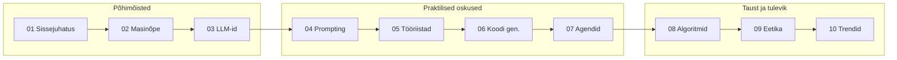

---
tags:
  - AI
---

# Õppematerjalid

Teoreetiline osa koosneb 10 peatükist, mis katavad tehisintellekti alused alates ajaloost kuni agentlike töövoogudeni. Iga peatüki lõpus on enesekontrolliküsimused.

---

## Sissejuhatus ja põhimõisted

| # | Teema | Kirjeldus |
|---|-------|-----------|
| [01](01_sissejuhatus.md) | Sissejuhatus | Mis on tehisintellekt, ajalugu, mõisted |
| [02](02_masinoppe_alused.md) | Masinõppe alused | Juhendatud, juhendamata ja sügavõpe |
| [03](03_llm_taust.md) | Suurte keelemudelite taust | Transformer, GPT, tokeniseerimine |

---

## Praktilised oskused

| # | Teema | Kirjeldus |
|---|-------|-----------|
| [04](04_prompt_engineering.md) | Prompt engineering | Tehnikad, mallid, parimad praktikad |
| [05](05_tooriistad.md) | AI tööriistade ülevaade | ChatGPT, Claude, Copilot, Ollama |
| [06](06_koodi_genereerimine.md) | Koodi genereerimine | AI-abilised arenduses ja IT-töös |
| [07](07_agentlik_toovoog.md) | Agentlik töövoog | MCP, tööriistakasutus, autonoomsed agendid |

---

## Taust ja tulevikuvaade

| # | Teema | Kirjeldus |
|---|-------|-----------|
| [08](08_andmed_algoritmid.md) | Andmed ja algoritmid | Andmestruktuurid, otsing, sorteerimine AI kontekstis |
| [09](09_eetika_turvalisus.md) | Eetika ja turvalisus | Kallutatus, privaatsus, vastutustundlik kasutamine |
| [10](10_tulevikutrendid.md) | Tulevikutrendid | Multimodaalsus, AGI, AI tööturu mõju |

---

<figure markdown="span">

  <figcaption>Joonis 0.1. Kursuse läbimise soovituslik järjekord (Talvik, 2026).</figcaption>
</figure>
